## On the design of decentralized exchanges

 

**Fayçal Drissi**

 

[scholar](https://scholar.google.com/citations?user=njvyriQAAAAJ&hl=fr), 
[website](https://www.faycaldrissi.com/), [github](https://github.com/FDR0903)

--- 

# Decentralised Finance (DeFi)
###  Blockchains
* Distributed ledger without central authority
* **Social benefits**: transparency, less intermediaries and monopolies, easier transfer of value, help for underbanked populations

--- 

# Decentralised Finance (DeFi)
###  Blockchains
* Distributed ledger without central authority
* **Social benefits**: transparency, less intermediaries and monopolies, easier transfer of value, help for underbanked populations

 

### Applications and growing relevance
* Central Bank Digital Currencies (CBDCs)
    * **Economic benefits**: better monetary policy oversight[^mpolicy]
* Tokenisation of financial (bonds, stocks, ETFs) & non-financial assets (commodities, real estate)
    * **Economic benefits**: reduce transaction costs and processing time

  

[^mpolicy]: [CBDC and Monetary Policy](https://www.banqueducanada.ca/2020/02/note-analytique-personnel-2020-4/)
---

# Decentralised Finance (DeFi)
### Adoption by institutions and infrastructures
###### G20, Bank of International Settlements, Bank of France, Monetary Authority of Singapore, Central Bank of Malaysia, and Swiss National Bank
* Inter-bank and cross-border Forex trading: **inter-bank FX Settlement** using **DeFi**[^source][^source1]
<!--* Incentive for technological innovation-->
   
  

[^source]: Cross-border settlement in CBDCs is an explicit priority policy goal of the G20[^source2][^source3]
[^source1]: [Project Mariana](https://www.bis.org/about/bisih/topics/cbdc/mariana.htm)
[^source2]: [Project Rialto](https://www.bis.org/about/bisih/topics/cbdc/rialto.htm)
[^source4]: [International Monetary Fund (IMF) On Cross-Border Crypto Flows](https://papers.ssrn.com/sol3/papers.cfm?abstract_id=5080183&dgcid=ejournal_htmlemail_cryptocurrency%3Aresearch%3Aejournal_abstractlink)
[^source3]: [Other example: Stablecoins and risks: Supervision and regulation of asset-backed stablecoins](https://www.bis.org/about/bisih/topics/suptech_regtech/pyxtrial.htm)

<!---
# Applications: FX settlement
**Project Mariana:** BIS Innovation Hub, Bank of France, Monetary Authority of Singapore and Swiss National Bank. 
Source: BIS innovation Hub
* **Central banks** manage access to wCBDC on domestic and transnational network. They issue/redeem coins on their domestic networks
* **Commercial banks** use and transfer wCBDC within domestic and transnational network
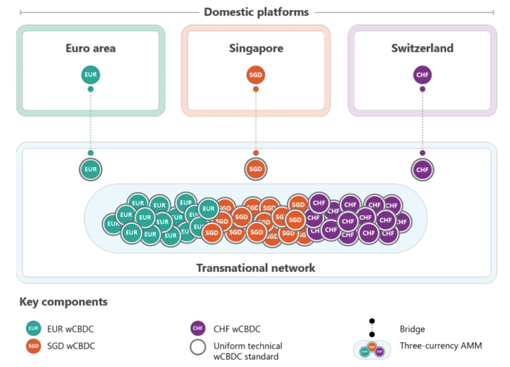{style="transform: translate(30%, 0%); width: 480px"} -->

---

# Decentralised Finance (DeFi)
### Adoption by institutions and infrastructures
###### G20, Bank of International Settlements, Bank of France, Monetary Authority of Singapore, Central Bank of Malaysia, and Swiss National Bank
* Inter-bank and cross-border Forex trading: **inter-bank FX Settlement** using **DeFi**[^source][^source1]
<!--* Incentive for technological innovation-->

 

### Research is multi-disciplinary
* At the interface of engineering, business, economics, public policy, and mathematics
   

[^source]: Cross-border settlement in CBDCs is an explicit priority policy goal of the G20[^source2][^source3]
[^source1]: [Project Mariana](https://www.bis.org/about/bisih/topics/cbdc/mariana.htm)
[^source2]: [Project Rialto](https://www.bis.org/about/bisih/topics/cbdc/rialto.htm)
[^source4]: [International Monetary Fund (IMF) On Cross-Border Crypto Flows](https://papers.ssrn.com/sol3/papers.cfm?abstract_id=5080183&dgcid=ejournal_htmlemail_cryptocurrency%3Aresearch%3Aejournal_abstractlink)
[^source3]: [Other example: Stablecoins and risks: Supervision and regulation of asset-backed stablecoins](https://www.bis.org/about/bisih/topics/suptech_regtech/pyxtrial.htm)

---
layout: center
---

<h2>
It is <b>key</b> to study these new markets to influence policy and practice at early stages, and to achieve its potential </h2>

---

# Research

### Past
* Chracterise, mathematically and empirically, the costs to operate on blockchains and how to interact optimally
  

### Current
* Study and improve the design of decentralised finance 

---
layout: center
---

<h2>Definition    Decentralised Finance and Decentralised Exchanges </h2>

--- 

# Decentralised Finance: two parts
 

### Blockchains

* Infrastructure
* Lifecycle of transactions

 
 

### Smart contracts

* Public programs on the blockchain: define the rules of interactions
* Immutable and permissionless

 
 

---

<h2> Decentralised Finance </h2>

 

<h3>An ecosystem of smart contracts that <em>mimic</em> traditional financial services without  intermediaries </h3>

 
 
 

---

<h2> Decentralised Finance </h2>

 

<h3>An ecosystem of smart contracts that <em>mimic</em> traditional financial services without  intermediaries </h3>

 
 
 

<h2> Decentralised exchanges </h2>
 
<h3>
Trading platforms where the rules of interaction are encoded in a smart contract operating on the blockchain   </h3>

--- 

# Table of contents

   

### Part I: smart contracts

* DEXs hinder strategic behaviour of liquidity providers
* Mathematical model to address this inefficiency

   

### Part II: blockchains

* Blockchain protocols hinder information dissemination and cause superfluous infrastructure costs
* Economic model to describe DEX microstructure and improve it

 
 

 
 

---
layout: center
---

<h2>
Part I: smart contracts    
Automated Market Makers (AMM)   </h2>
 

[Cartea, Á., Drissi, F., Sánchez-Betancourt, L., Siska, D., & Szpruch, L. (2024).   Strategic bonding curves in automated market makers](https://papers.ssrn.com/sol3/papers.cfm?abstract_id=5018420)

---
layout: fact
--- 

# Contributions
1. Identify the **axioms** of AMMs

2. Describe market frictions

3. Identify **design flaws**

4. **Novel design** to **level the playing field** with traditional markets

---

# Why AMMs

* Price to add a transaction to the blockchain: **gas fee**

    * "gas" refers to the required computational power
    * Gas fees scale with transaction complexity

* Significantly expensive to run traditional markets on a blockchain
* **Constraints**: computational simplicity
* **Solution**: Automated market makers (AMMs)

---

# Automated Market Makers
### Liquidity pooling
* A liquidity pool for Security $X$ and $Y$.
* Available *reserves* $x$ and $y$.

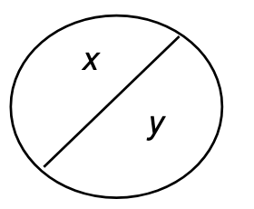{style="transform: translate(165%, 20%); width: 200px"}

---

# Automated Market Makers

### Two types of participants

* **Liquidity takers (LTs)** trade with the pool

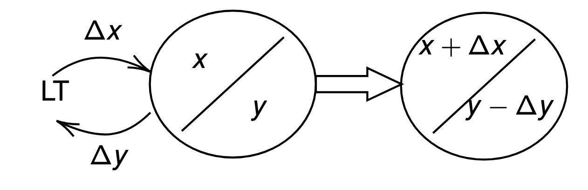{style="transform: translate(30%, 50%); width: 500px"}

---

# Automated Market Makers
### Two types of participants
* **Liquidity providers (LPs)** *deposit* assets in the pool or *withdraw* assets from the pool

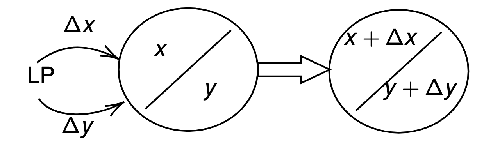{style="transform: translate(31.5%, 51%); width: 500px"}

---

# Automated Market Makers
### Economic principle: bonding curves

*  Iso-liquidity curve or indifference curve (points of same level of liquidity)

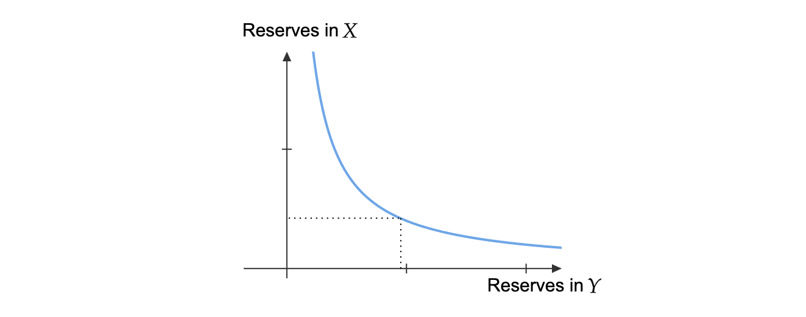{style="transform: translate(18%, 10%); width: 630px"}

---

# Automated Market Makers
### Liquidity takers

* To buy a quantity $\Delta y$, one pays
$$
\frac{\Delta x}{\Delta y} = \frac{\Phi(y-\Delta y) - \Phi(y)}{\Delta y}
$$

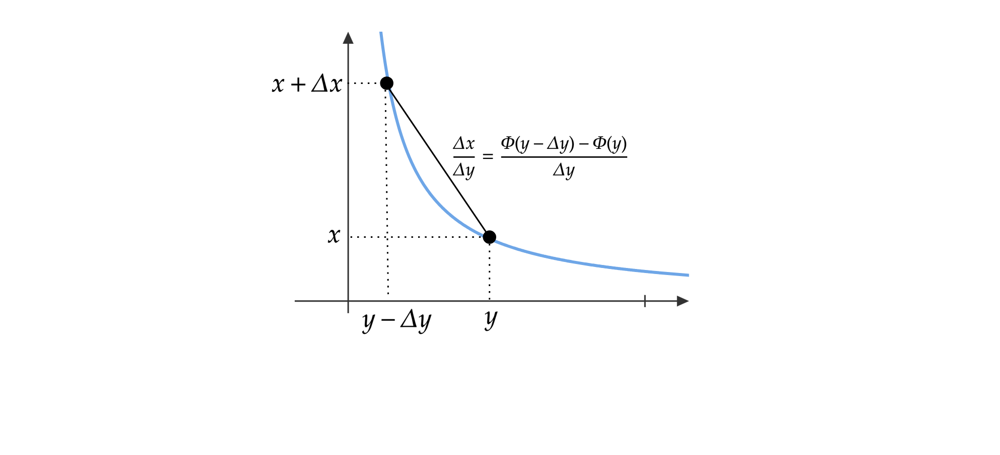{style="transform: translate(18%, 10%); width: 630px"}

---

# Automated Market Makers
### Liquidity takers

* To sell a quantity $\Delta y$, one receives
$$
\frac{\Delta x}{\Delta y} = \frac{\Phi(y) - \Phi(y+\Delta y)}{\Delta y}
$$

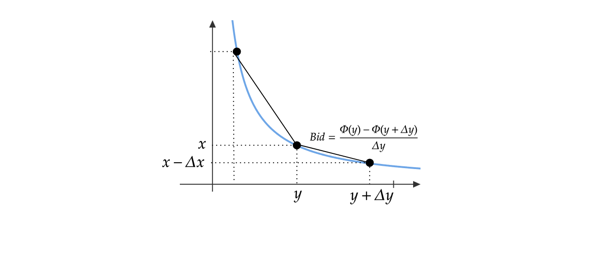{style="transform: translate(18%, 10%); width: 630px"}

---

# Automated Market Makers
### Liquidity takers

* **Marginal Price** and **slippage**
$$
\underbrace{\frac{\Phi(y)-\Phi(y+\Delta y)}{\Delta y}}_{\text{bid } \approx Z -  \Phi''(\Delta y)\, \Delta y/2}
    \xrightarrow{\Delta y \longrightarrow 0}  \underbrace{Z=-\Phi'(y) }_{\text{marginal price}}\xleftarrow{0\longleftarrow \Delta y} \underbrace{\frac{\Phi(y-\Delta y)-\Phi(y)}{\Delta y}}_{\text{ask } \approx Z + \Phi''(\Delta y)\, \Delta y/2} 
$$

---
layout: two-cols-header
---

# Automated Market Makers
### Liquidity takers

* **Marginal Price** and **slippage**
$$
\underbrace{\frac{\Phi(y)-\Phi(y+\Delta y)}{\Delta y}}_{\text{bid } \approx Z -  \Phi''(\Delta y)\, \Delta y/2}
    \xrightarrow{\Delta y \longrightarrow 0}  \underbrace{Z=-\Phi'(y) }_{\text{marginal price}}\xleftarrow{0\longleftarrow \Delta y} \underbrace{\frac{\Phi(y-\Delta y)-\Phi(y)}{\Delta y}}_{\text{ask } \approx Z + \Phi''(\Delta y)\, \Delta y/2} 
$$

::left::

 

Scatter plot of transaction costs  and the approximation for all transactions in the  ETH/USDC pool:   $6.76 \times 10^6$ transactions between *5 May 21* and *31 December 23*

 

[Cartea, Á., Drissi, F., & Monga, M. (2023). Decentralised finance and automated market making: Execution and speculation](https://arxiv.org/abs/2307.03499)

::right::

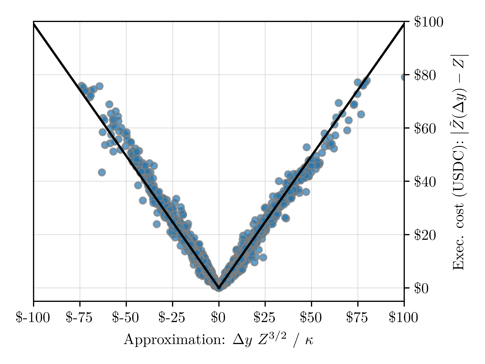{style="transform: translate(20%, 0%); width: 350px"}

---

# Automated Market Makers
### Liquidity takers

* **Price impact** following a buy order of volume $\Delta y$
$$
Z_0 = -\Phi'(y) \longrightarrow Z_1 = -\Phi'(y-\Delta y) \approx Z_0 + \Phi''(y)\,\Delta y
$$
* **Price impact** following a sell order of volume $\Delta y$
$$
Z_0 = -\Phi'(y) \longrightarrow Z_1 = -\Phi'(y+\Delta y) \approx Z_0 - \Phi''(y)\,\Delta y
$$

---

# Automated Market Makers
### Liquidity providers

* Liquidity providers add liquidity without changing the marginal price $Z$[^fnmp]
<!--* Liquidity providers earn *transaction fees*-->
        

[^fnmp]: The trading function is parameterised. In Uniswap
$
\Phi(y) = \frac{\kappa}{y} \implies -\Phi'(y) =  \frac{x}{y}
$

---

# Automated Market Makers
### Liquidity providers

* Liquidity providers add liquidity without changing the marginal price $Z$[^fnmp]
* They earn proportional fees

       

[^fnmp]: The trading function is parameterised. In Uniswap
$
\Phi(y) = \frac{\kappa}{y} \implies -\Phi'(y) =  \frac{x}{y}
$

[^fn3]: [Cartea, Á., Drissi, F., & Monga, M. (2023). Predictable losses of liquidity provision in constant function markets and concentrated liquidity markets. Applied Mathematical Finance](https://www.tandfonline.com/doi/full/10.1080/1350486X.2023.2277957)

---

# Automated Market Makers
### Liquidity providers

* Liquidity providers add liquidity without changing the marginal price $Z$[^fnmp]
* They earn proportional fees
* LPs incur losses[^fn3]
<!--* Change in wealth of LPs against not providing liquidity-->
$$
0 \ge \Phi(y-\Delta y)-\Phi(y)+\Delta y \, \Phi'(y-\Delta y) \approx -\frac12 \Phi''(y) \, \Delta y^2
$$
<!--$$
\text{L}_{t}= -\frac{1}{2}\int_{0}^{t}\,\Phi''\left(y_{s}\right)\,d<y,y>_{s}
$$-->
   

[^fnmp]: The trading function is parameterised. In Uniswap
$
\Phi(y) = \frac{\kappa}{y} \implies -\Phi'(y) =  \frac{x}{y}
$

[^fn3]: [Cartea, Á., Drissi, F., & Monga, M. (2023). Predictable losses of liquidity provision in constant function markets and concentrated liquidity markets. Applied Mathematical Finance](https://www.tandfonline.com/doi/full/10.1080/1350486X.2023.2277957)

---

# Losses in Ethereum and Uniswap[^fn2][^fn6]

| | Average      | Standard Deviation | 
|  :---  | :---        |    :----:   | 
| Losses  | $-1.64\%$ | $7.5\%$ |
| Revenue |  $0.155\%$   | $0.274\%$        |
| Hold time |   $6.1$ days   |  $22.4$ days       |
<!--| Number of transactions per LP | $11.5$ | $40.2$ | -->

 
 
 

[^fn2]: [Cartea, Á., Drissi F., & Monga M. (2024) "Decentralized Finance and Automated Market Making: Predictable Loss and Optimal Liquidity Provision." SIAM Journal on Financial Mathematics.](https://epubs.siam.org/doi/full/10.1137/23M1602103)
[^fn6]: [Cartea, Á., Drissi, F., & Monga, M. (2023). Predictable losses of liquidity provision in constant function markets and concentrated liquidity markets. Applied Mathematical Finance.](https://www.tandfonline.com/doi/full/10.1080/1350486X.2023.2277957)

---

# Losses in Ethereum and Uniswap

* LPs can reduce these losses significantly[^fn2][^fn6]
* The core issue persists: LPs have limited strategic flexibility
* **Solution**: design DEXs that give LPs the tools to express strategic preferences

     
  
 

[^fn2]: [Cartea, Á., Drissi F., & Monga M. (2024) "Decentralized Finance and Automated Market Making: Predictable Loss and Optimal Liquidity Provision." SIAM Journal on Financial Mathematics.](https://epubs.siam.org/doi/full/10.1137/23M1602103)
[^fn6]: [Cartea, Á., Drissi, F., & Monga, M. (2023). Predictable losses of liquidity provision in constant function markets and concentrated liquidity markets. Applied Mathematical Finance.](https://www.tandfonline.com/doi/full/10.1080/1350486X.2023.2277957)

---
layout: center
---

<h1>
Improving AMMs </h1>

---

# AMM design

### Objective
* Provide strategic tools to LPs

 

### Generalising bonding curves
* Defines the price of liquidity and the price dynamics **seperately**
* The price of liquidity is determined by the reserves and **other relevant information**  

 

### Constraints
* Use  **available information** on the blockchain
* **Simple mechanics** to update prices and reserves

---

# AMM design

### Decentralised Liquidity Pool (DLP)

* Reserves $\{x, y\}$

* Marginal Price $Z$

* LTs impact the price according to impact functions $\{\eta^b, \eta^a\}$

* The slippage is determined by quote functions $\{\delta^b, \delta^a\}$[^fndlp2]

      

[^fndlp2]: We derive conditions for the imapct and quote functions to prevent roundtrip arbitrage and price manipulation 

---

# AMM design

### Liquidity takers 

* $\left(N_t^b\right)_{t\in[0,T]}$ and $\left(N_t^a\right)_{t\in[0,T]}$: counting processes for the number of sell and buy orders of minimum trading volume $\zeta$

* The dynamics of the DLP reserves
$$
d y_{t}=\,\zeta\, d N_{t}^{b}-\zeta\, d N_{t}^{a}
$$
$$
d x_{t}=\,-\zeta\,\left( Z_{t^-}-\delta_{t}^{b} \right)\,d N_{t}^{b}
+
\zeta\,\Big(Z_{t^-}+\delta_{t}^{a}\Big)\, d N_{t}^{a}
$$

* The dynamics of the marginal price
$$
d Z_{t}=-\eta^b(y_{t^-})\,d N_{t}^{b} + \eta^a(y_{t^-})\,d N_{t}^{a}
$$

<!--### Liquidity providers
* They set the functions $\{\eta^b,\eta^a,\delta^b,\delta^a\}$ periodically-->

--- 

# AMM design

### AMM $\subset$ DLP

* Let $\Phi$ be the trading function of an AMM
* Let the impact functions of the DLP be
$$
\eta^a(y) = \Phi'(y)  - \Phi'(y-\zeta)\,\quad\text{and}\quad  \eta^b(y) = -\Phi'(y) + \Phi'(y +\zeta)
$$
* Let the quote functions of the DLP be
$$\delta^a_t = \frac{\Phi(y_{t^-} - \zeta) - \Phi(y_{t^-})}{\zeta} + \Phi'(y_{t^-}) + \pi \, \zeta
$$

$$
\delta^b_t = \frac{\Phi(y_{t^-} + \zeta) - \Phi(y_{t^-})}{\zeta} - \Phi'(y_{t^-}) + \pi \, \zeta
$$
* Then DLP $\equiv$ AMM !

--- 

# AMM design

### DLP bonding curves
* The bonding curve of a DLP is defined by $\{\delta^b, \delta^a, \eta^b, \eta^a\}$

 

### Strategic tools of LPs
* LPs can set these functions according to strategic preferences
* *Restrictions*: employ information on the blockchain

--- 

# Strategic bonding curve

### A model
* Let $P$ be the (unobserved) fundamental price
* We discretise $Z - P$ into $M$ values, or regimes.
* $g \notin \mathbb F$ is a CTMC with finite state space $\mathcal S = \{1, \dots, M\}$ that describes the regimes. The transition rate matrix is $\Pi$
<!--    * Regime $1$ corresponds to $P<<Z$
    * Regime $M$ corresponds to $Z<<P$-->

---

# Strategic bonding curve
### A model
* LTs are sensitive to the **fundamental price**. The vectors 
$$\boldsymbol{c}^b = \{c^{b,1},\dots,c^{b,M}\} \quad \text{and} \quad \boldsymbol{c}^a = \{c^{a,1},\dots,c^{a,M}\}$$ 
describe the **baseline  intensity** of the trading flow at the bid/ask in each regime $j\in\{1,\dots,M\}$
* LTs are sensitive to the **slippage**. If $g_t = j$
$$
\lambda^{b,j}_t(\delta^b_t)=  c^{b,j}\,e^{-\kappa\,\delta_{t}^{b}} 
$$
$$
\lambda^{a,j}_t(\delta^a_t)= c^{a,j}\,e^{-\kappa\,\delta_{t}^{a}}
$$

---

# Strategic bonding curve
### Filtering from the trading flow
* The DLP does not  observe the regime $g$.
* We can assign a probability $\Psi^{j}_{t}$ to be in regime $j$ at time $t$ given $\mathcal{F}_t$ 
$$
 \Psi^{j}_{t} = \mathbb{E}\left[ \mathrm{1}_{g_t = j} \,\mid\,\mathcal{F}_t\right]
$$

--- 

# Strategic bonding curve
### Filtering from the trading flow
* The  filter $\Psi^{j}_{t}$ satisfies 

$$
\Psi^{j}_{t} = \frac{\Gamma^j_t}{\sum_{i=1}^M\Gamma^i_t} \,,
$$
where the process $\Gamma^j$, for $j\in\{1,\dots,M\}$, follows the dynamics
$$
\frac{d \Gamma^j_t }{\Gamma^j_t} = \left( \lambda^{a,j}_{t^-}\left(\delta_t^a\right) - 1\right)\left(d N^{a}_t -d t\right) +  \left( \lambda^{b,j}_{t^-}\left(\delta_t^b\right) - 1\right)\left(d N^{b}_t -d t\right) + \frac{\sum_{i=1}^{M}\Gamma_{t^{-}}^{i}}{\Gamma_{t^{-}}^{j}} \,\pi_{ji}\,d t
$$

---

# Strategic bonding curve

### Adaptive control problem
* We compute the optimal quote functions $\{\delta^b, \delta^a\}$ for fixed impact functions $\{\eta^b,\eta^a\}$

---

# Strategic bonding curve

### Adaptive control problem
* We compute the optimal quote functions $\{\delta^b, \delta^a\}$ for fixed impact functions $\{\eta^b,\eta^a\}$
* We consider Poisson processes $N^b$ and $N^a$ with projected stochastic intensities $\hat{\lambda}^{b}$ and $\hat{\lambda}^{a}$
$$
\begin{cases}
\hat{\lambda}_{t}^{b} =  e^{-\kappa\,\delta_{t}^{b}}\, \mathrm{c}^{b}\cdot\mathrm{\Psi}_{t} \\
\hat{\lambda}_{t}^{a} =  e^{-\kappa\,\delta_{t}^{a}}\, \mathrm{c}^{a}\cdot\mathrm{\Psi}_{t}
\end{cases}
$$

---

# Strategic bonding curve

### Adaptive control problem
* We compute the optimal quote functions $\{\delta^b, \delta^a\}$ for fixed impact functions $\{\eta^b,\eta^a\}$
* We consider Poisson processes $N^b$ and $N^a$ with projected stochastic intensities $\hat{\lambda}^{b}$ and $\hat{\lambda}^{a}$
$$
\begin{cases}
\hat{\lambda}_{t}^{b} =  e^{-\kappa\,\delta_{t}^{b}}\, \mathrm{c}^{b}\cdot\mathrm{\Psi}_{t} \\
\hat{\lambda}_{t}^{a} =  e^{-\kappa\,\delta_{t}^{a}}\, \mathrm{c}^{a}\cdot\mathrm{\Psi}_{t}
\end{cases}
$$
* The performance criterion[^pcm] (well-posed)
$$
\mathbb{E}_{t,x,y,z,\mathrm{\Psi}}\left[x_{T}+y_T\,Z_T\right]
$$

  

[^pcm]: The set of admissible bonding curves is
$
\mathcal A_t~=~\Big\{ (\delta^b_s, \delta^a_s)_{s \in [t,T]},\ \mathbb R^2\text{-valued},\ \mathbb F\text{-adapted, square-integrable, bounded from below}\Big\}
$

---

# Strategic bonding curve
### The solution
* The optimal bonding curve (in feedback form)
$$
\delta_{t}^{\star,b}=\frac{1}{\kappa}-\frac{\theta\left(t,y+\zeta,\frac{\tilde{\mathrm{\psi}}\odot\tilde{\mathrm{c}}^{b}}{\psi\cdot\mathrm{c}^{b}}\right)-\theta\left(t,y,\tilde{\mathrm{\psi}}\right)}{\zeta}+\frac{1}{\zeta}\left(\frac{\tilde{\mathrm{\psi}}\odot\tilde{\mathrm{c}}^{b}}{\psi\cdot\mathrm{c}^{b}}\cdot\nabla_{\tilde{\mathrm{\psi}}}\theta-{\tilde{\mathrm{\psi}}}\cdot\nabla_{\tilde{\mathrm{\psi}}}v+\left(y+\zeta\right)\eta^{b}(y)\right)
$$
$$
\delta_{t}^{\star,a}=\frac{1}{\kappa}-\frac{\theta\left(t,y-\zeta,\frac{\tilde{\mathrm{\psi}}\odot\tilde{\mathrm{c}}^{a}}{\psi\cdot\mathrm{c}^{a}}\right)-\theta\left(t,y,\tilde{\mathrm{\psi}}\right)}{\zeta}+\frac{1}{\zeta}\left(\frac{\tilde{\mathrm{\psi}}\odot\tilde{\mathrm{c}}^{a}}{\psi\cdot\mathrm{c}^{a}}\cdot\nabla_{\tilde{\mathrm{\psi}}}\theta-{\tilde{\mathrm{\psi}}}\cdot\nabla_{\tilde{\mathrm{\psi}}}v-\left(y-\zeta\right)\eta^{a}(y)\right)\,.
$$

---

# Strategic bonding curve
### Experiments
* Two regimes: $c^b = 5\times c^a$ and $c^a = 5 \times c^b$ 

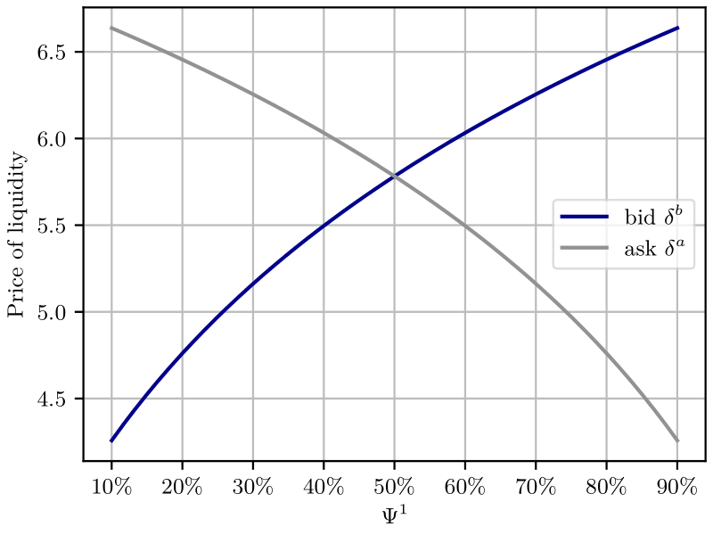{style="transform: translate(55%, 10%); width: 400px"}

<!--::right::
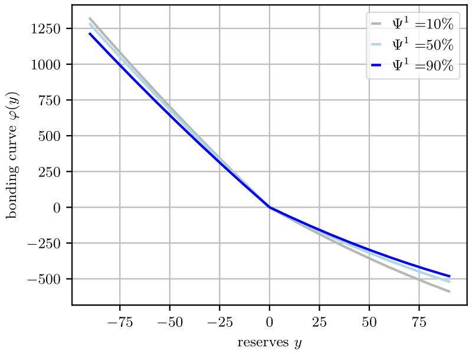{style="transform: translate(0%, 10%); width: 400px"}-->

---
layout: two-cols-header
---

# Strategic bonding curve
### Experiments
* Scenario I : $100\%$ arbitrageurs
* Scenario II: $50\%$ arbitrageurs, $50\%$ noise traders

::left::
| | Average$^1$      | Standard Deviation | 
|  :---  | :---        |    :----:   | 
| DLP (Sc. I) | $-0.04\%$ | $0.719\%$ | 
| DLP (Sc. II)   | $0.717%$ | $2.584\%$ |
| Buy and Hold |  $0.01\%$   | $0.741\%$        |
| Uniswap$^2$ |   $-1.485\%$    |  $7.812\%$ |

1. $30$-minutes performance of LPs 
2. Using $42,022$ LP operations between 5 May 2021 and 30 April 2022*

::right::

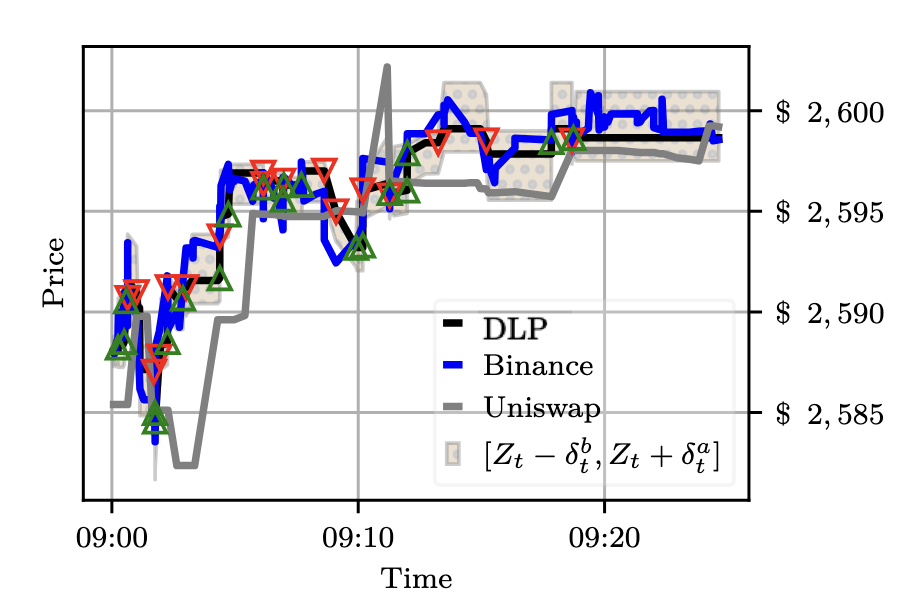{style="transform: translate(10%, 0%); width: 400px"}

---
layout: center
---

<h1>
Part II:  Blockchain design </h1>

[Capponi, A., Cartea, Á., Drissi, F.   Price Formation in Memory Pools](https://www.faycaldrissi.com/mempools-talk/1)

---

# Blockchain protocol

* Transactions are sent to the network continuously, and stored in a memory pool
   

{style="transform: translate(20%, 0%); width: 680px"}

---

# Blockchain protocol

* Transactions are sent to the network continuously, and stored in a memory pool
* At each Epoch, with length block time, a validator is chosen
  

{style="transform: translate(20%, 3%); width: 680px"}

<!---

#  Decentralised Exchanges

* Liquidity supply and price of liquidity
* Price dynamics-->

---

# Blockchain protocol

* Transactions are sent to the network continuously, and stored in a memory pool
* At each Epoch, with length block time, a validator is chosen
* The validator creates a new block with transactions from the memory pool

{style="transform: translate(20%, 0%); width: 680px"}

---

# Blockchain protocol

### Gas fees (EIP-1559, Ethereum London fork)
* **Base fee**: based on congestion. prerequisite for inclusion
* **Priority fee**: incentivise validators to prioritise a transaction in the block

---

# Blockchain protocol

### Gas fees (EIP-1559, Ethereum London fork)
* **Base fee**: based on congestion. prerequisite for inclusion
* **Priority fee**: incentivise validators to prioritise a transaction in the block

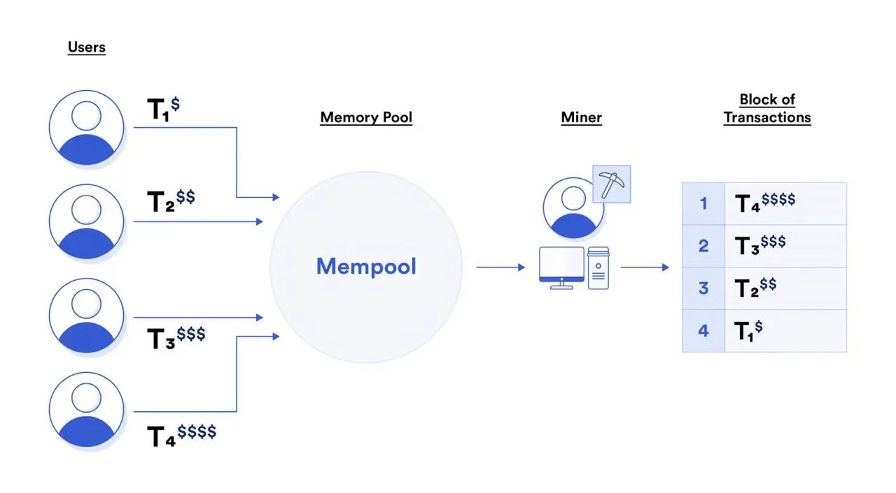{style="transform: translate(25%, 0%); width: 580px"}

---

# Blockchain protocol

## Consequences
 

#### Pre-trade transparency

* Agents observe pending and unconfirmed transactions

 

#### Priority gas auctions
* Competitive agents submit/revise priority gas fees to obtain better prices

 

#### Price discovery
* Additional vehicle for price discovery in blockchains:  priority fees

---
layout: fact
--- 

# Contributions
   

1. Describe the **microstructure of decentralised exchanges** under **pre-trade transparency** and **priority gas auctions**.

 

2. Simple and implementable **design features** to **improve price efficiency**, information dissemination, and decrease rent extraction from validators

---
layout: center
---

<h1>
An economic model </h1>

---

# The model

### The market

* Trading is conducted in an AMM with trading function $\Phi$
* Two risk-neutral informed traders $i$ and $j$ compete to **buy** $Y$ during block time ($12$ seconds)
* They submit priority fees $\varphi_i$ and $\varphi_j$

---

# The model

### The information
* Trade have private information $v_i>0$ and $v_j>0$ about the liquidation value $V$
$$
V_i = \mathbb E[V | v_i] = V(i)
$$
* The signals are independently drawn from an interval $[0, \overline{v}]$ according to a density $f$.

---

# The model

### The trading volumes
* They wish to buy volumes $\delta_i = \delta(v_i)$ and $\delta_j = \delta(v_j)$
* The demand function $\delta$ is continuously differentiable and increasing
* They are determined endogenously 

<!--* The volumes $\delta_i$ are drawn from $[\delta(0),\delta(\overline v)]=[\underline \delta,\overline \delta]$ according to  
$$g(x) = f\left(\delta^{-1}\left(x\right)\right)\Big/\delta^{'}\left(\delta^{-1}\left(x\right)\right)$$-->

---

# The model

### Competition for queue priority
* With queue priority, the **slippage** for a volume $\delta$ is
$$
\frac12 \,\delta\, \Phi''(y_0) = \delta / \kappa
$$
* The price impact is
$$
\delta\, \Phi''(y_0) = 2\,\delta / \kappa 
$$
* **Slippage** for a **subsequent trade** with volume $\delta$
$$
V_0 + \underbrace{2\,\delta / \kappa}_{\text{impact}} + \underbrace{\delta/\kappa}_{\text{slippage}} = V_0 +3\,\delta/ \kappa
$$

---

# The model

### Competition for queue priority

* If trader $i$ **wins** the auction, i.e., if $\varphi_{i}>\varphi_j$, their wealth is
$$
W_{i}\left(\text{win}\right)=\underbrace{-\varphi_{i}}_{\text{priority fee}}\,\underbrace{-\delta_{i}\,\left(V_{0}+\delta_{i}/\kappa\right)}_{\text{price and slippage}}\underbrace{+\delta_{i}\,V}_{\text{liquidation value}}
=\,-\varphi_{i}\,-\delta_{i}^{2}/\kappa+\delta_{i}\,V
$$
 

---

# The model

### Competition for queue priority

* If trader $i$ **wins** the auction, i.e., if $\varphi_{i}>\varphi_j$, their wealth is
$$
W_{i}\left(\text{win}\right)=\underbrace{-\varphi_{i}}_{\text{priority fee}}\,\underbrace{-\delta_{i}\,\left(V_{0}+\delta_{i}/\kappa\right)}_{\text{price and slippage}}\underbrace{+\delta_{i}\,V}_{\text{liquidation value}}
=\,-\varphi_{i}\,-\delta_{i}^{2}/\kappa+\delta_{i}\,V
$$
 

* If trader $i$ **loses** the auction, i.e., if $\varphi_{i}<\varphi_j$, their wealth is
$$
W_{i}\left(\text{lose}\right)=-\delta_{i}\,\left(V_{0}+3\,\delta_{i}/\kappa\right) +\delta_{i}\,V
 =-3\,\delta_{i}^{2}/\kappa+\delta_{i}\,V
$$

---

# The model

### Competition for queue priority

<!--= P_{i}\,\mathbb E[W_{i}\left(\text{win}\right)] + (1-P_{i})\,\mathbb E[W_{i}\left(\text{lose}\right)]-->
* The expected wealth of informed traders 
$$
\mathbb{E}\left[W_{i}\right] = \mathbb P_i\left[\varphi_i>\varphi_j\right]\,\left(-\varphi_{i}+2\,\delta_{i}^2/\kappa\right)-3\,\delta_{i}^{2}/\kappa+\delta_{i}\,V_{i}
$$

---
layout: image-right
image: ./images/gamels.png
backgroundSize: 180%
---

# The model

### The liquidity supply

* A risk-neutral LP sets the **pool size** $\kappa$ by balancing **losses** to informed traders with **revenue** from liquidity demand
<!-- A risk-neutral liquidity supplier sets a pool with size $\kappa$ A risk-neutral LP balances losses to informed traders from adverse selection with fee revenue from liquidity demand The fee rate in the pool is $\pi$ Price-sensitive liquidity demanders submit transactions with an absolute total volume $N$ which nets to zero The LP balances losses to informed traders from adverse selection with fee revenue from liquidity demand -->
* Losses to informed traders[^fnilp]
$$
\text{L} = - \kappa\, \mathbb E[( \delta_i +  \delta_j)^2]
$$
* Revenue from liquidity demand
$$
\text{E}=\pi\,N\,(1-\theta/\kappa)
$$

 

[^fnilp]: The LP does not have information about $V$ and assumes $v_i$ and $v_j$ are drawn from $[-\overline v, \overline v]$

---
layout: two-cols-header
---

# Equilibrium priority fees

::left::
 
 

* In equilibrium, traders submit transactions at the end of block time

           

::right::

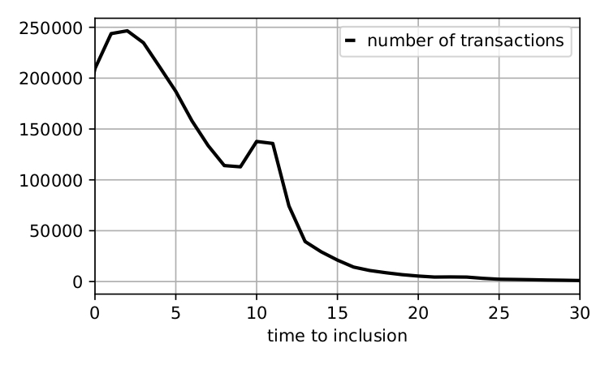{style="transform: translate(40%, -10%); width: 280px"}
$\qquad\quad$ Ethereum memory pool transaction data  
$\qquad\qquad\qquad$ $10-16$ December $2022$

 

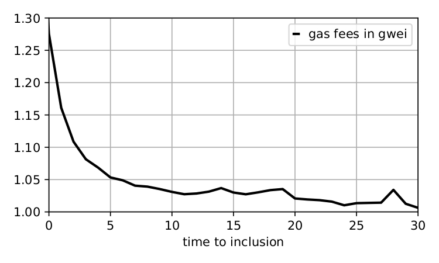{style="transform: translate(40%, -10%); width: 280px"}

---

# Equilibrium properties
* Price efficiency is hindered
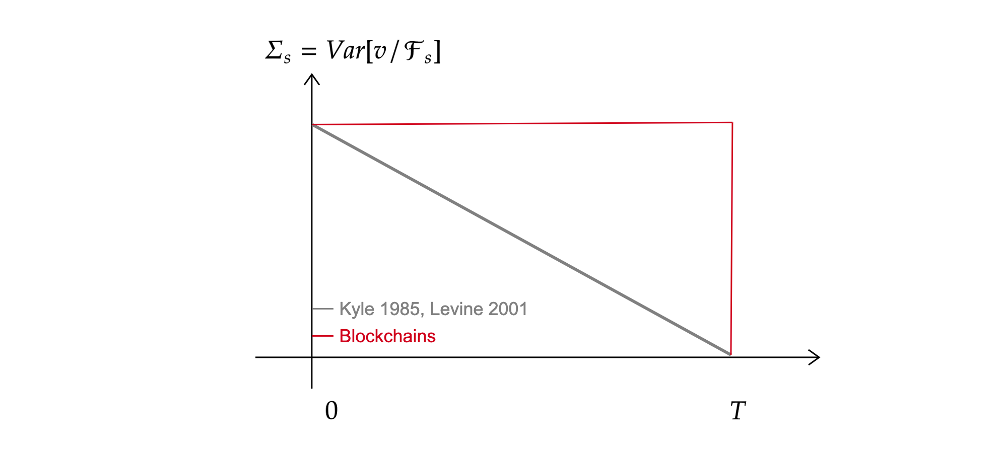{style="transform: translate(70%, -20%); width: 450px"}
* Priority fees **increase** with **liquidity demand**, **fragmentation**, and **variance**[^addition]
$$
\mathbb{E}\left[\text{PF}\right]\propto4\,\sqrt{\pi\,N\,\theta}\,\mathbb{E}\left[\varphi_{i}^{\star}+\varphi_{j}^{\star}\right]
$$
* Trading volumes **decrease** with **competition**
$
\qquad \qquad \mathbb E[\delta_i^{\star}] = \kappa \, V_{i} \Big / 2\left(3- F\left(v_{i}\right)\right)
$
  

[^addition]: Block time is $12$ seconds $\implies$ signals with high variance

---

# Blockchains with random block time

* Consider a first round with probability $\tau$ that trades are executed

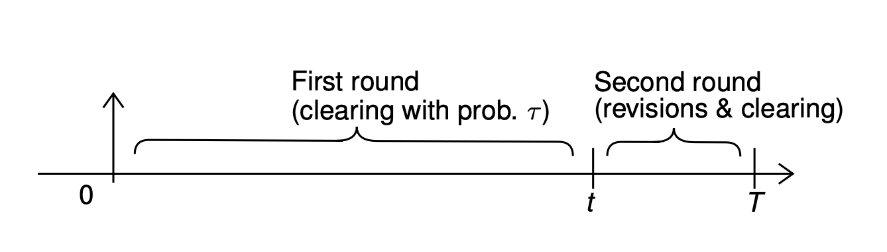{style="transform: translate(60%, -20%); width: 400px"}

* There exists $\overline \tau < 1$, such that whenever $\tau > \overline\tau$, bidding in both rounds holds in equilibrium
  

---

# New equilibrium properties

* Priority fees decrease
$$
E[\varphi_i^{\tau,\star}]  < \mathbb E[\varphi_i^{\star}] 
$$

  

<!-- \kappa^\star \, \mathbb{E}\left[\int_{0}^{v_{i}}\delta\left(x\right)^{2}\,f\left(x\right)\,dx\right] -->

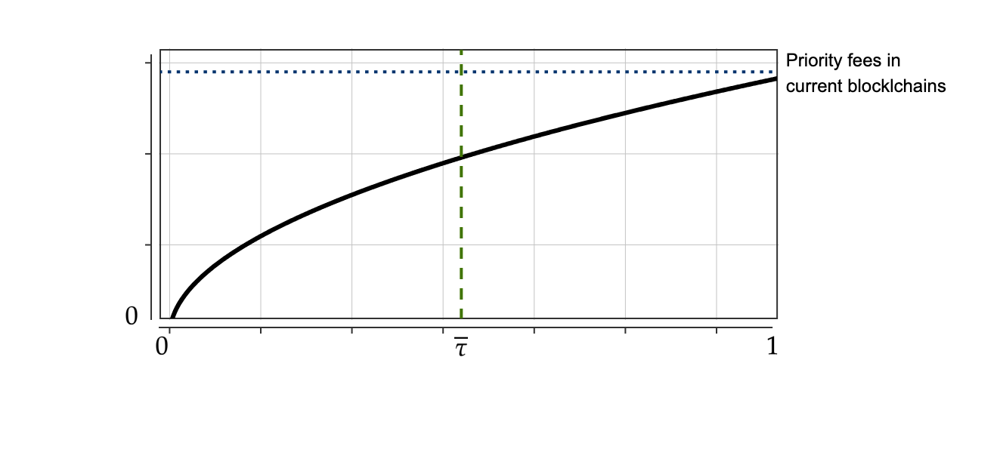{style="transform: translate(40%, 0%); width: 500px"}

---

# New equilibrium properties

* Price efficiency improves

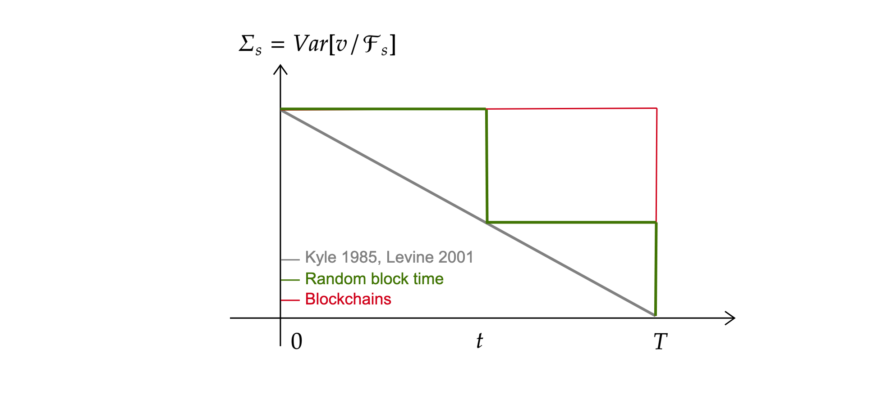{style="transform: translate(0%, 0%); width: 800px"}

---

# New equilibrium properties
* Proportional volumes **increase**
$$
\mathbb E[\delta_i^{\tau,\star}] = \kappa \, \frac{V_{i}}{2\left(3- (2-\tau) F\left(v_{i}\right)\right)} > \mathbb E[\delta_i^{\star}]
$$

---

# New equilibrium properties

* Liquidity supply decreases
$$
\kappa^{\tau,\star}=\sqrt{\pi\,N\,\theta\Big / \mathbb{E}\left[\left(\delta_i^{\tau,\star}+\delta_j^{\tau,\star}\right)^{2}\right]} < \kappa^{\star}
$$

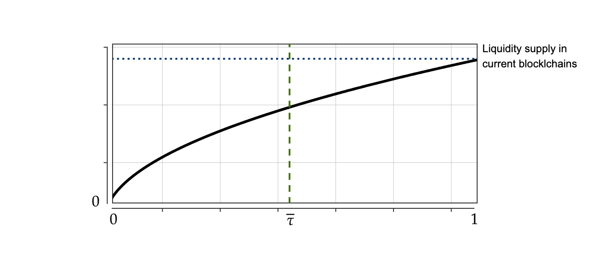{style="transform: translate(40%, 0%); width: 500px"}

* **In practice**, $\overline v^\tau < \overline v \implies$ variance of volumes decreases $\implies$ liquidity supply increases

<!--* In practice, signal variance at round one is lower than that of round two $\implies$ -->

---
layout: center
--- 

# Future of decentralised finance

---

# DeFi protocols

| **Service**       | **DeFi**      | **TradFi** | 
|  :---         | :---        |    :----   | 
| Trading |  DEXes (Uniswap, Curve)|  Brokers & exchanges | 
| Credit | Lenders post assets in liquidity pools, and borrowers borrow against collateral (Compound, Aave) |  Commercial banks| 
| Payments |  Transfer of value onchain via DeFi protocols (Flexa, Sablier Finance) |  Cash, Credit/debit cards, accounts | 
| Insurance |  Customers buy tokens in exchange for cover against digital or real-life risks (Armor, Nexus Mutual) |  Insurance firms | 
| Investment and Derivatives | Funds are allocated to pools based on preset risk tolerance. Vehicles include crypto-indices, derivatives, options, and perpetual futures (Yearn Finance, dY dX) | Investment funds | 

---
layout: end
---

[faycaldrissi.com/jmp-talk](https://www.faycaldrissi.com/jmp-talk)

[faycaldrissi.com](https://www.faycaldrissi.com)