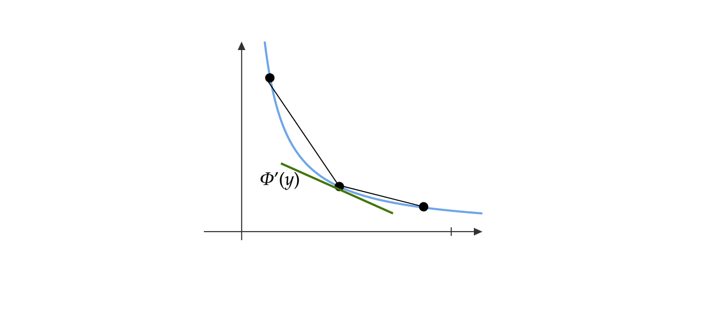
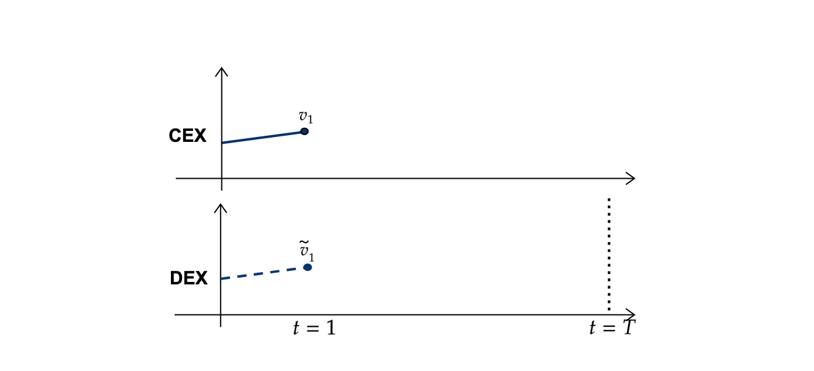
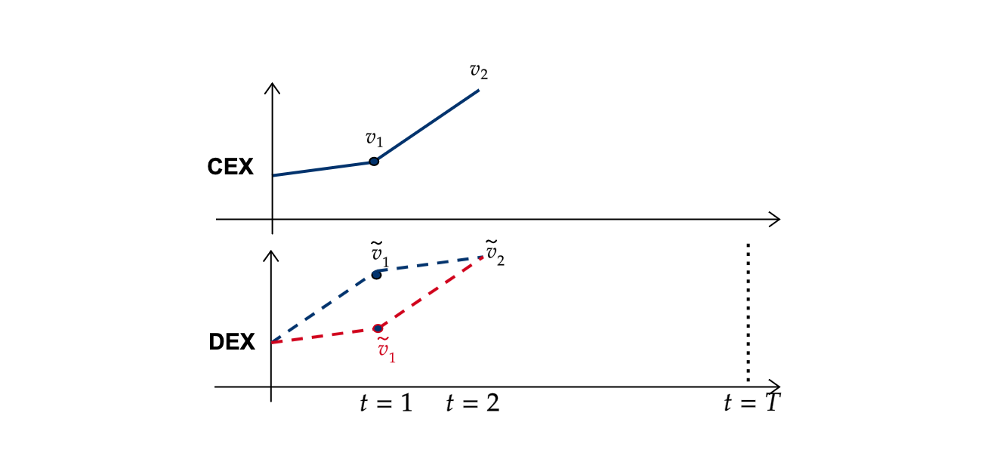
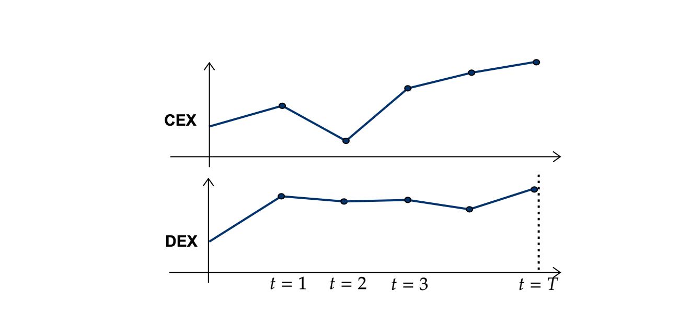

# On the design of decentralized exchanges

**Fayçal Drissi**

**16 January 2025**

[scholar](https://scholar.google.com/citations?user=njvyriQAAAAJ&hl=fr), 
[website](https://www.faycaldrissi.com/), [github](https://github.com/FDR0903)

---
layout: center
---

<h1>
Decentralised Finance </h1>

---

# Decentralised Finance: two parts
 

### Blockchains

* Infrastructure and decentralization
* Lifecycle of transactions

 
 

### Smart contracts

* Public programs on the blockchain: define the rules of interactions
* Immutable and permissionless

 
 

---

<h2> Decentralised Finance </h2>

 

<h3>An ecosystem of smart contracts that <em>mimic</em> traditional financial services without  intermediaries </h3>

 
 
 

---

<h2> Decentralised Finance </h2>

 

<h3>An ecosystem of smart contracts that <em>mimic</em> traditional financial services without  intermediaries </h3>

 
 
 

<h2> Decentralised exchanges </h2>
 
<h3>
Trading platforms where the rules of interaction are encoded in a smart contract operating on the blockchain   </h3>

--- 

# Blockchains

* Single state computer on a shared network

{style="transform: translate(50%, 0%); width: 480px"}

* Distributed ledger without central authority
    * A record of consensus with cryptographic audit trail
    * Benefits: transparency and fractionalization

---
layout: center
---

<h1>
Why DeFi Matters </h1>

---

# Tokenisation
The tokenisation of assets on blockchains is gaining momentum at an institutional and governmental level[^fncbdc]

* Currencies: Central Bank Digital Currencies (CBDC)
* Financials: bonds, loans, stocks, ETFs, mortages
* Non-financials: commodities, real estate, art, music
* **Objectives**: 
    * Better monetary policy oversight
    * Reduce transaction costs and processing time
    * Reduce intermediaries and monopolies
    * Simplify the transfer of value

 

[^fncbdc]: A common standard for fungible  tokens with design features based on central bank (or regulator) requirements

---

# Adoption by institutions and infrastructures
###### G20, Bank of International Settlements, Bank of France, Monetary Authority of Singapore, Central Bank of Malaysia, and Swiss National Bank 

*  Inter-bank FX Settlement[^source1]:  Cross-border trading between financial institutions using **automated market makers**

    * **Cross-border payments** and settlement in CBDCs is an explicit international policy goal and a priority of the G20[^source2]

* Stablecoins and risks[^source3]: Supervision and regulation of asset-backed stablecoins

  

[^source1]: [source](https://www.bis.org/about/bisih/topics/cbdc/mariana.htm)
[^source2]: [source](https://www.bis.org/about/bisih/topics/cbdc/rialto.htm)
[^source3]: [source](https://www.bis.org/about/bisih/topics/suptech_regtech/pyxtrial.htm)

<!---

# Applications: FX settlement
**Project Mariana:** BIS Innovation Hub, Bank of France, Monetary Authority of Singapore and Swiss National Bank. 
Source: BIS innovation Hub

* **Central banks** manage access to wCBDC on domestic and transnational network. They issue/redeem coins on their domestic networks
* **Commercial banks** use and transfer wCBDC within domestic and transnational network

{style="transform: translate(30%, 0%); width: 480px"} -->

---

# Other reasons

* Help underbanked populations

* Competition for intermediaries to drive costs down

* Incentives for technological innovations

* Research is multi-disciplinary: mathematics, finance, economics, computer science, law, ...

---
layout: center
---

<h2>
It is <b>key</b> to study these new markets to influence policy and practice at early stages </h2>

---
layout: center
---

<h1>
Automated Market Makers   
AMMs</h1>

 

[Cartea, Á., Drissi, F., Sánchez-Betancourt, L., Siska, D., & Szpruch, L. (2024).   Strategic bonding curves in automated market makers](https://papers.ssrn.com/sol3/papers.cfm?abstract_id=5018420)

---

# Blockchains and gas fees

* Price to add a transaction to the blockchain: **gas fee**
* "gas" refers to the required computational power
* Gas fees scale with transaction complexity
* Extremely expensive to run traditional markets on a blockchain
* Constraints: computational simplicity

 

## Solution

* Automated market makers (AMMs)

---

# Automated Market Makers
### Liquidity pooling

* A liquidity pool for Security $X$ and $Y$.

* Available *reserves* $x$ and $y$.

{style="transform: translate(165%, 20%); width: 200px"}

---

# Automated Market Makers

### Two types of participants

* **Liquidity takers (LTs)** trade with the pool

{style="transform: translate(30%, 50%); width: 500px"}

---

# Automated Market Makers
### Two types of participants
* **Liquidity providers (LPs)** *deposit* assets in the pool or *withdraw* assets from the pool

{style="transform: translate(31.5%, 51%); width: 500px"}

---

# Automated Market Makers
### Economic principle: bonding curves

*  Iso-liquidity curve or indifference curve (points of same level of liquidity)

* A function $\Phi$ that maps changes in the reserves in security $X$ to changes in the reserves in security $Y$

{style="transform: translate(18%, 10%); width: 630px"}

---
layout: image-right 
image: ./images/bc2.png
backgroundSize: 170%
---

# Automated Market Makers
### Liquidity takers

* The reserves of the AMM are $x$ and $y$
$$
x = \Phi(y) 
$$

* To buy a quantity $\Delta y$, one pays
$$
\Delta x = \Phi(y-\Delta y) - \Phi(y)
$$

* The new reserves are 
$$
x+\Delta x \quad  \text{and} \quad y - \Delta y
$$

---
layout: image-right 
image: ./images/bc3.png
backgroundSize: 170%
---

# Automated Market Makers
### Liquidity takers

* The reserves of the AMM are $x$ and $y$
$$
x = \Phi(y) 
$$

* To sell a quantity $\Delta y$, one receives
$$
\Delta x = \Phi(y) - \Phi(y+\Delta y)
$$

* The new reserves are 
$$
x-\Delta x \quad  \text{and} \quad y + \Delta y
$$

---

# Automated Market Makers
### Liquidity takers

* Marginal Price
$$
\underbrace{\frac{\Phi(y)-\Phi(y+\Delta y)}{\Delta y}}_\text{bid price}
    \xrightarrow{\Delta y \longrightarrow 0}  \underbrace{-\Phi'(y) }_{\text{marginal price}}\xleftarrow{0\longleftarrow \Delta y} \underbrace{\frac{\Phi(y-\Delta y)-\Phi(y)}{\Delta y}}_\text{ask price} 
$$

* No-arbitrage $\implies$ $\Phi$ is convex.

{style="transform: translate(20%, -5%); width: 630px"}

---
layout: two-cols-header
---

# Automated Market Makers
### Liquidity takers

* Slippage

$$
Z - \frac12 \Phi''(\Delta y)\, \Delta y \approx\underbrace{ \frac{\Phi(y) - \Phi(y+\Delta y)}{\Delta y}}_{\text{bid price}} \leq Z \leq  \underbrace{\frac{\Phi(y) - \Phi(y-\Delta y)}{\Delta y}}_{\text{ask price}} \approx Z + \frac12 \Phi''(\Delta y)\, \Delta y
$$

::left::

 

Scatter plot of transaction costs  and the approximation for all transactions in the ETH/USDC pool:   $6.76 \times 10^6$ transactions between *5 May 2021* and *31 December 2023*

[Cartea, Á., Drissi, F., & Monga, M. (2023). Decentralised finance and automated market making: Execution and speculation](https://arxiv.org/abs/2307.03499)

::right::

{style="transform: translate(20%, 0%); width: 350px"}

---

# Automated Market Makers
### Liquidity takers

* Price impact following a buy order of volume $\Delta y$
$$
Z_1 - Z_0 =  -\Phi'(y-\Delta y) + \Phi'(y) \approx \Phi''(y)\,\Delta y
$$

---

# Automated Market Makers
### Liquidity providers

* Liquidity providers add liquidity without changing the marginal price $-\Phi'(y)$.

* The trading function is parameterised. In Uniswap
$$
\Phi(y) = \frac{\kappa}{y} \implies -\Phi'(y) =  \frac{x}{y}. 
$$

<!--* Liquidity providers earn *transaction fees*-->

---

# Automated Market Makers
### Liquidity providers

* Change in wealth of LPs against not providing liquidity

$$
\Phi(y-\Delta y)-\Phi(y)+\Delta y \, \Phi'(y-\Delta y) \le 0 \quad (\approx -\frac12 \Phi(''y)\,\Delta y^2)
$$

* LPs incur predictable losses[^fn3]

$$
\text{PL}_{t}= -\frac{1}{2}\int_{0}^{t}\,\Phi''\left(y_{s}\right)\,d<y,y>_{s}
$$

* They also incur opportunity costs

      

[^fn3]: [Cartea, Á., Drissi, F., & Monga, M. (2023). Predictable losses of liquidity provision in constant function markets and concentrated liquidity markets. Applied Mathematical Finance](https://www.tandfonline.com/doi/full/10.1080/1350486X.2023.2277957)

---

# Predictable losses in Ethereum and Uniswap[^fn2][^fn6]

| | Average      | Standard Deviation | 
|  :---  | :---        |    :----:   | 
| Number of transactions per LP | $11.5$ | $40.2$ | 
| Position value performance  | $-1.64\%$ | $7.5\%$ |
| Fee revenue |  $0.155\%$   | $0.274\%$        |
| Hold time |   $6.1$ days   |  $22.4$ days       |

 
 

[^fn2]: [Cartea, Á., Drissi F., & Monga M. (2024) "Decentralized Finance and Automated Market Making: Predictable Loss and Optimal Liquidity Provision." SIAM Journal on Financial Mathematics.](https://epubs.siam.org/doi/full/10.1137/23M1602103)
[^fn6]: [Cartea, Á., Drissi, F., & Monga, M. (2023). Predictable losses of liquidity provision in constant function markets and concentrated liquidity markets. Applied Mathematical Finance.](https://www.tandfonline.com/doi/full/10.1080/1350486X.2023.2277957)

---
layout: center
---

<h1>
AMM Design </h1>

---
layout: fact
--- 

# Our contributions
   

1. Identify the **axioms** that **DEXs** operate under

 

2. Introduce a **novel design** with more strategic flexibity for liquidity providers

 

3. Develop models that
    * can be implemented as smart contracts on blockchains
    * mitigate the costs of liquidity provision in current AMMs

---

# AMM design

### Generalising bonding curves
* Defines the price of liquidity and the price dynamics **seperately**
* The price of liquidity is determined by the reserves and **other relevant information**  

 

### Constraints
* Use  **available information** on the blockchain
* **Simple mechanics** to update prices and reserves

---

# AMM design

### Decentralised Liquidity Pool (DLP)

* Reserves $\{x, y\}$

* Marginal Price $Z$

* LTs impact the price according to deterministic impact functions $\{\eta^b, \eta^a\}$

* The slippage is determined by quote functions $\{\delta^b, \delta^a\}$

---

# AMM design

### Liquidity takers 
* Minimum trading volume $\zeta$ (Orders have volume $n\times \zeta$)

* Slippage for a volume $\zeta$
$$
Z - \delta^b(y, I) \le Z \le Z + \delta^a(y, I)
$$
* Price impact following a buy order of volume $\zeta$ or a sell order of volume $\zeta$
$$
Z \longrightarrow Z + \eta^a(y)
$$
$$
Z \longrightarrow Z - \eta^b(y)
$$

---

# AMM design

### Liquidity takers 
* Minimum trading volume $\zeta$ (Orders have volume $n\times \zeta$)

* Slippage for a volume $\zeta$
$$
Z - \delta^b(y, I) \le Z \le Z + \delta^a(y, I)
$$
* Price impact following a buy order of volume $\zeta$ or a sell order of volume $\zeta$
$$
Z \longrightarrow Z + \eta^a(y)
$$
$$
Z \longrightarrow Z - \eta^b(y)
$$

### Liquidity providers
* They set the functions $\{\eta^b,\eta^a,\delta^b,\delta^a\}$ periodically

---

# AMM design

### Price and liquidity dynamics

* $\left(N_t^b\right)_{t\in[0,T]}$ and $\left(N_t^a\right)_{t\in[0,T]}$: counting processes for the number of sell and buy orders

* The dynamics of the DLP reserves
$$
d y_{t}=\,\zeta\, d N_{t}^{b}-\zeta\, d N_{t}^{a}
$$
$$
d x_{t}=\,-\zeta\,\left( Z_{t^-}-\delta_{t}^{b} \right)\,d N_{t}^{b}
+
\zeta\,\Big(Z_{t^-}+\delta_{t}^{a}\Big)\, d N_{t}^{a}
$$

* The dynamics of the marginal price
$$
d Z_{t}=-\eta^b(y_{t^-})\,d N_{t}^{b} + \eta^a(y_{t^-})\,d N_{t}^{a}
$$

--- 

# AMM design

### AMM $\subset$ DLP

* Let $\Phi$ be the trading function of an AMM
* Let the impact functions of the DLP be
$$
\eta^a(y) = \Phi'(y)  - \Phi'(y-\zeta)\,\quad\text{and}\quad  \eta^b(y) = -\Phi'(y) + \Phi'(y +\zeta)
$$
* Let the quote functions of the DLP be
$$\delta^a_t = \frac{\Phi(y_{t^-} - \zeta) - \Phi(y_{t^-})}{\zeta} + \Phi'(y_{t^-}) + \underbrace{\pi \, \zeta}_{\text{If fees } \neq 0}
$$

$$
\delta^b_t = \frac{\Phi(y_{t^-} + \zeta) - \Phi(y_{t^-})}{\zeta} - \Phi'(y_{t^-}) + \underbrace{\pi \, \zeta }_{\text{If fees }\neq 0}
$$

* Then DLP $\equiv$ CFM !

--- 

# AMM design

### Strategic bonding curves
* The bonding curve of a DLP is defined by $\{\delta^b, \delta^a, \eta^b, \eta^a\}$

* LPs can set these functions according to strategic preferences

* Restrictions: implementable in a smart contract $\implies$ employs information on the blockchain

--- 

# Strategic bonding curve

### The model
* Let $P$ be the unobserved fundamental price

* We discretise $Z - P$ into $M$ values, or regimes.
* $g \notin \mathbb F$ is a CTMC with finite state space $\mathcal S = \{1, \dots, M\}$ that describes the regimes. The transition rate matrix is $\Pi$
    * Regime $1$ corresponds to $P<<Z$
    * Regime $M$ corresponds to $Z<<P$

---

# Strategic bonding curve
### The model
* Liquidity takers are sensitive to the price of liquidity (slippage) 
$$Z^a - P = \delta^a + Z - P  \quad \text{and} \quad P - Z^b = \delta^b + P - Z$$
* The vectors $\boldsymbol{c}^b = \{c^{b,1},\dots,c^{b,M}\}$ and $\boldsymbol{c}^a = \{c^{a,1},\dots,c^{a,M}\}$ describe the **baseline  intensity** of the trading flow at the bid/ask in each regime $j\in\{1,\dots,M\}$
$$
\lambda_{t}^{b}\left(\delta_{t}^{b},g_t\right)= \sum_{j=1}^M c^{b,j}\,e^{-\kappa\,\delta_{t}^{b}} \,\mathrm{1}_{g_t = j}= \sum_{j=1}^M \lambda^{b,j}_t(\delta^b_t)\,\mathrm{1}_{g_t = j}
$$
$$
\lambda_{t}^{a}\left(\delta_{t}^{a},g_t\right)= \sum_{j=1}^M c^{a,j}\,e^{-\kappa\,\delta_{t}^{a}} \,\mathrm{1}_{g_t = j}= \sum_{j=1}^M \lambda^{a,j}_t(\delta^a_t)\,\mathrm{1}_{g_t = j}
$$

--- 

# Strategic bonding curve
### The model
* The DLP does not  observe the regime $g$.  
* Available information in the blockchain: the trading flow 
* We can assign a probability probability $\Psi^{j}_{t}$ to be in regime $j$ at time $t$ given $\mathcal{F}_t$ 
$$
 \Psi^{j}_{t} = \mathbb{E}\left[ \mathrm{1}_{g_t = j} \,\mid\,\mathcal{F}_t\right]
$$

--- 

# Strategic bonding curve
### Regime probability
* The  filter $\Psi^{j}_{t}$ satisfies 

$$
\Psi^{j}_{t} = \frac{\Gamma^j_t}{\sum_{i=1}^M\Gamma^i_t} \,,
$$
where the process $\Gamma^j$, for $j\in\{1,\dots,M\}$, follows the dynamics
$$
\frac{d \Gamma^j_t }{\Gamma^j_t} = \left( \lambda^{a,j}_{t^-}\left(\delta_t^a\right) - 1\right)\left(d N^{a}_t -d t\right) +  \left( \lambda^{b,j}_{t^-}\left(\delta_t^b\right) - 1\right)\left(d N^{b}_t -d t\right) + \frac{\sum_{i=1}^{M}\Gamma_{t^{-}}^{i}}{\Gamma_{t^{-}}^{j}} \,\pi_{ji}\,d t
$$

---

# Strategic bonding curve

### The dynamic optimisation problem
* We look for optimal quote functions $\{\delta^b, \delta^a\}$ for fixed impact functions $\{\eta^b,\eta^a\}$

---

# Strategic bonding curve

### The dynamic optimisation problem
* We look for optimal quote functions $\{\delta^b, \delta^a\}$ for fixed impact functions $\{\eta^b,\eta^a\}$
* We consider Poisson processes $N^b$ and $N^a$ with projected stochastic intensities $\hat{\lambda}^{b}$ and $\hat{\lambda}^{a}$
$$
\begin{cases}
\hat{\lambda}_{t}^{b} =  e^{-\kappa\,\delta_{t}^{b}}\, \mathrm{c}^{b}\cdot\mathrm{\Psi}_{t} \\
\hat{\lambda}_{t}^{a} =  e^{-\kappa\,\delta_{t}^{a}}\, \mathrm{c}^{a}\cdot\mathrm{\Psi}_{t}
\end{cases}
$$

---

# Strategic bonding curve

### The dynamic optimisation problem
* We look for optimal quote functions $\{\delta^b, \delta^a\}$ for fixed impact functions $\{\eta^b,\eta^a\}$
* We consider Poisson processes $N^b$ and $N^a$ with projected stochastic intensities $\hat{\lambda}^{b}$ and $\hat{\lambda}^{a}$
$$
\begin{cases}
\hat{\lambda}_{t}^{b} =  e^{-\kappa\,\delta_{t}^{b}}\, \mathrm{c}^{b}\cdot\mathrm{\Psi}_{t} \\
\hat{\lambda}_{t}^{a} =  e^{-\kappa\,\delta_{t}^{a}}\, \mathrm{c}^{a}\cdot\mathrm{\Psi}_{t}
\end{cases}
$$
* The performance criterion (well-posed)
$$
\mathbb{E}_{t,x,y,z,\mathrm{\Psi}}\left[x_{T}+y_T\,Z_T - \alpha\,(y_T-\hat y)^2 -\phi\,\int_{t}^{T} (y_s-\hat y)^{2}\,d s\right]
$$
*  The set of admissible bonding curves
$$
\mathcal A_t = \bigg\{ (\delta^b_s, \delta^a_s)_{s \in [t,T]},\ \mathbb R^2\text{-valued},\ \mathbb F\text{-adapted, square-integrable, and bounded from below by $\underline{\delta}$}\bigg\}, 
$$

---

# Strategic bonding curve
### The solution
* The optimal bonding curve (in feedback form)
$$
\delta_{t}^{\star,b}=\frac{1}{\kappa}-\frac{\theta\left(t,y+\zeta,\frac{\tilde{\mathrm{\psi}}\odot\tilde{\mathrm{c}}^{b}}{\psi\cdot\mathrm{c}^{b}}\right)-\theta\left(t,y,\tilde{\mathrm{\psi}}\right)}{\zeta}+\frac{1}{\zeta}\left(\frac{\tilde{\mathrm{\psi}}\odot\tilde{\mathrm{c}}^{b}}{\psi\cdot\mathrm{c}^{b}}\cdot\nabla_{\tilde{\mathrm{\psi}}}\theta-{\tilde{\mathrm{\psi}}}\cdot\nabla_{\tilde{\mathrm{\psi}}}v+\left(y+\zeta\right)\eta^{b}(y)\right)
$$
$$
\delta_{t}^{\star,a}=\frac{1}{\kappa}-\frac{\theta\left(t,y-\zeta,\frac{\tilde{\mathrm{\psi}}\odot\tilde{\mathrm{c}}^{a}}{\psi\cdot\mathrm{c}^{a}}\right)-\theta\left(t,y,\tilde{\mathrm{\psi}}\right)}{\zeta}+\frac{1}{\zeta}\left(\frac{\tilde{\mathrm{\psi}}\odot\tilde{\mathrm{c}}^{a}}{\psi\cdot\mathrm{c}^{a}}\cdot\nabla_{\tilde{\mathrm{\psi}}}\theta-{\tilde{\mathrm{\psi}}}\cdot\nabla_{\tilde{\mathrm{\psi}}}v-\left(y-\zeta\right)\eta^{a}(y)\right)\,.
$$

---
layout: two-cols-header 
---
# Strategic bonding curve
### Experiments
* Two regimes: $c^b = 5\times c^a$ and $c^a = 5 \times c^b$ 

::left::

{style="transform: translate(0%, 10%); width: 400px"}

::right::

{style="transform: translate(0%, 10%); width: 400px"}

---
layout: two-cols-header
---

# Strategic bonding curve
### Experiments
* Scenario I : $100\%$ arbitrageurs
* Scenario II: $50\%$ arbitrageurs, $50\%$ noise traders

::left::
| | Average$^1$      | Standard Deviation | 
|  :---  | :---        |    :----:   | 
| DLP (Sc. I) | $-0.04\%$ | $0.719\%$ | 
| DLP (Sc. II)   | $0.717%$ | $2.584\%$ |
| Buy and Hold |  $0.01\%$   | $0.741\%$        |
| Uniswap$^2$ |   $-1.485\%$    |  $7.812\%$ |

1. $30$-minutes performance of LPs 
2. Using $42,022$ LP operations between 5 May 2021 and 30 April 2022*

::right::

{style="transform: translate(10%, 0%); width: 400px"}

---
layout: center
---

<h1>
Blockchain design </h1>

[Capponi, A., Cartea, Á., Drissi, F.   Price Formation in Memory Pools](https://www.faycaldrissi.com/mempools-talk/1)

---

# Blockchain protocol

* Transactions are sent to the network continuously, and stored in a memory pool
   

{style="transform: translate(20%, 0%); width: 680px"}

---

# Blockchain protocol

* Transactions are sent to the network continuously, and stored in a memory pool
* At each Epoch, with length block time, a validator is chosen
  

{style="transform: translate(20%, 3%); width: 680px"}

<!---

#  Decentralised Exchanges

* Liquidity supply and price of liquidity
* Price dynamics-->

---

# Blockchain protocol

* Transactions are sent to the network continuously, and stored in a memory pool
* At each Epoch, with length block time, a validator is chosen
* The validator creates a new block with transactions from the memory pool

{style="transform: translate(20%, 0%); width: 680px"}

---

# Blockchain protocol

### Gas fees (EIP-1559, Ethereum London fork)
* **Base fee**: based on congestion. prerequisite for inclusion
* **Priority fee**: incentivise validators to prioritise a transaction in the block

---

# Blockchain protocol

### Gas fees (EIP-1559, Ethereum London fork)
* **Base fee**: based on congestion. prerequisite for inclusion
* **Priority fee**: incentivise validators to prioritise a transaction in the block

{style="transform: translate(25%, 0%); width: 580px"}

---

# Blockchain protocol

## Consequences
 

### Pre-trade transparency

* Agents observe pending and unconfirmed transactions

 

### Priority gas auctions
* Competitive agents submit/revise priority gas fees to obtain better prices

 

### Price discovery
* Additional vehicle for price discovery in blockchains:  priority fees

---

# Blockchain protocol
### Illustration of trading mechanisms
 

{style="transform: translate(5%, 5%); width: 780px"}

---

# Blockchain protocol
### Illustration of trading mechanisms
 

{style="transform: translate(5%, 5%); width: 780px"}

---

# Blockchain protocol
### Illustration of trading mechanisms
 

{style="transform: translate(1.8%, 3.4%); width: 780px"}

---
layout: fact
--- 

## Our contributions
   

1. Describe the **microstructure of decentralised exchanges** under **pre-trade transparency** and **priority gas auctions**.

 

2. Simple and implementable **design features** to **improve price efficiency**, information dissemination, and decrease rent extraction from validators

---
layout: center
---

<h1>
The model </h1>

---

# The model

### The market

* Trading is conducted in an AMM with trading function $\Phi$ for a pair of securities $X$ and $Y$ 
* Initial marginal price $V_0$, initial reserves $y_0$
* Two informed traders $i$ and $j$ compete to **buy** $Y$ during block time ($12$ seconds)
* They submit priority fees $\varphi_i$ and $\varphi_j$

---

# The model

### The information
* Trade have private information $v_i>0$ and $v_j>0$ about the liquidation value $V$
$$
V_i = \mathbb E[V | v_i] = V(i)
$$
* The signals are independently drawn from an interval $[0, \overline{v}]$ according to a density $f$.

---

# The model

### The trading volumes
* They wish to buy volumes $\delta_i = \delta(v_i)$ and $\delta_j = \delta(v_j)$
* The demand function $\delta$ is continuously differentiable and increasing.
<!--* The volumes $\delta_i$ are drawn from $[\delta(0),\delta(\overline v)]=[\underline \delta,\overline \delta]$ according to  
$$g(x) = f\left(\delta^{-1}\left(x\right)\right)\Big/\delta^{'}\left(\delta^{-1}\left(x\right)\right)$$-->

---

# The model

### Competition for queue priority
* For a volume $\delta$, the **slippage** is
$$
\approx\frac12 \,\delta\, \Phi''(y_0) = \delta / \kappa
$$
* Following a buy with volume $\delta$, the price impact on the marginal price is
$$
\approx \delta\, \Phi''(y_0) = 2\,\delta / \kappa 
$$
* Execution price for a **subsequent trade** with volume $\delta$
$$
V_0 + \underbrace{2\,\delta / \kappa}_{\text{impact}} + \underbrace{\delta/\kappa}_{\text{slippage}} = V_0 +3\,\delta/ \kappa
$$

---

# The model

### Competition for queue priority

* If trader $i$ wins the auction, i.e., if $\varphi_{i}>\varphi_j$, their wealth is
$$
W_{i}\left(\text{win}\right)=-\varphi_{i}\,\underbrace{-\delta_{i}\,\left(V_{0}+\delta_{i}/\kappa\right)}_{\text{initial trade}}\underbrace{+\delta_{i}\,V}_{\text{liquidation value}}
=\,\varphi_{i}\,-\delta_{i}^{2}/\kappa+\delta_{i}\,V
$$
 

---

# The model

### Competition for queue priority

* If trader $i$ wins the auction, i.e., if $\varphi_{i}>\varphi_j$, their wealth is
$$
W_{i}\left(\text{win}\right)=-\varphi_{i}\,\underbrace{-\delta_{i}\,\left(V_{0}+\delta_{i}/\kappa\right)}_{\text{initial trade}}\underbrace{+\delta_{i}\,V}_{\text{liquidation value}}
=\,\varphi_{i}\,-\delta_{i}^{2}/\kappa+\delta_{i}\,V
$$
 

* If trader $i$ loses the auction, i.e., if $\varphi_{i}<\varphi_j$, their wealth is
$$
W_{i}\left(\text{lose}\right)=-\delta_{i}\,\left(V_{0}+3\,\delta_{i}/\kappa\right) +\delta_{i}\,V
 =-3\,\delta_{i}^{2}/\kappa+\delta_{i}\,V
$$

---

# The model

### Competition for queue priority

* The expected wealth is 
$$
\mathbb{E}\left[W_{i}\right]= P_{i}\,\mathbb E[W_{i}\left(\text{win}\right)] + (1-P_{i})\,\mathbb E[W_{i}\left(\text{lose}\right)] = P_{i}\,\left(-\varphi_{i}+2\,\delta_{i}^2/\kappa\right)-3\,\delta_{i}^{2}/\kappa+\delta_{i}\,V_{i}
$$
where $P_i=\mathbb E_i\left[\varphi_i>\varphi_j\right]$

---

# The model

### Competition for queue priority

* The expected wealth is 
$$
\mathbb{E}\left[W_{i}\right]= P_{i}\,\mathbb E[W_{i}\left(\text{win}\right)] + (1-P_{i})\,\mathbb E[W_{i}\left(\text{lose}\right)] = P_{i}\,\left(-\varphi_{i}+2\,\delta_{i}^2/\kappa\right)-3\,\delta_{i}^{2}/\kappa+\delta_{i}\,V_{i}
$$
where $P_i=\mathbb E_i\left[\varphi_i>\varphi_j\right]$

* The optimisation problem of trader $i$
$$
U_{i}=\sup_{\varphi_{i}}\left\{ P_{i}\,\left(-\varphi_{i}+2\,\delta_{i}^2/\kappa\right)\right\}
$$

---
layout: two-cols-header
---

# Equilibrium priority fees

::left::
 
 

* In equilibrium, traders submit transactions at the end of block time

           

::right::

{style="transform: translate(40%, -10%); width: 280px"}
$\qquad\quad$ Ethereum memory pool transaction data  
$\qquad\qquad\qquad$ $10-16$ December $2022$

 

{style="transform: translate(40%, -10%); width: 280px"}

---
layout: two-cols-header
---

# Equilibrium priority fees

::left::
 
 
 
* In equilibrium, traders submit transactions at the end of block time

    

* The equilibrium priority fee
$$
\varphi^\star_i=2/\kappa\,\left(\delta\left(v_{i}\right)^2-\frac{\int_{0}^{v_{i}}\delta^{'}\left(x\right)\,\delta\left(x\right)\,F\left(x\right)\,dx}{F\left(v_{i}\right)}\right)\,
$$
* It is increasing in the signal and the range $\overline v$
* It is decreasing in the liquidity supply

::right::

{style="transform: translate(40%, -10%); width: 280px"}
$\qquad\quad$ Ethereum memory pool transaction data  
$\qquad\qquad\qquad$ $10-16$ December $2022$

 

{style="transform: translate(40%, -10%); width: 280px"}

---

# Equilibrium trading volume
 

* Trader $i$ solves the problem
$$
J_{i}=\sup_{\delta_{i}}\Bigg\{P_{i}\,\left(-\varphi_{i}^\star+2\,\delta_{i}^{2}/\kappa\right)-3\,\delta_{i}^{2}/\kappa+\delta_{i}\,V_{i}\Bigg\}\,.
$$

---

# Equilibrium trading volume
 

* Trader $i$ solves the problem
$$
J_{i}=\sup_{\delta_{i}}\Bigg\{P_{i}\,\left(-\varphi_{i}^\star+2\,\delta_{i}^{2}/\kappa\right)-3\,\delta_{i}^{2}/\kappa+\delta_{i}\,V_{i}\Bigg\}\,.
$$

* In equilibrium, informed traders transact a portion of the pool, which is increasing in the signal
$$
\delta^\star\left(v_{i}\right)=\kappa \, \frac{V_{i}}{2\left(3-F\left(v_{i}\right)\right)}
$$

---
layout: image-right
image: ./images/gamels.png
backgroundSize: 180%
---

# Equilbirum liquidity supply
### Assumptions

*  A risk-neutral liquidity supplier sets a pool with size $\kappa$

* The fee rate in the pool is $\pi$

*  The LP does not have information about $V$ and assumes $v_i$ and $v_j$ are drawn from $[-\overline v, \overline v]$

* Price-sensitive liquidity demanders submit transactions with an absolute total volume $N$ which nets to zero

---

# Equilbirum liquidity supply

### The LP balances losses to informed traders from adverse selection with fee revenue from liquidity demand

 

---

# Equilbirum liquidity supply

### The LP balances losses to informed traders from adverse selection with fee revenue from liquidity demand

 

* Losses to informed traders

$$
\text{L} \approx - \frac{1}{\kappa}\, \mathbb E[(\delta^\star(v_i) + \delta^\star(v_j))^2]
= - \kappa\, \mathbb E[(\tilde \delta^\star(v_i) + \tilde \delta^\star(v_j))^2]
$$

---

# Equilbirum liquidity supply

### The LP balances losses to informed traders from adverse selection with fee revenue from liquidity demand

 

* Losses to informed traders

$$
\text{L} = - \frac{1}{\kappa}\, \mathbb E[(\delta^\star(v_i) + \delta^\star(v_j))^2]
= - \kappa\, \mathbb E[(\tilde \delta^\star(v_i) + \tilde \delta^\star(v_j))^2]
$$

* Earnings from liquidity demand

$$
\text{E}=\pi\,N\,(1-\theta/\kappa)
$$

---

# Equilbirum liquidity supply

### The LP balances losses to informed traders from adverse selection with fee revenue from liquidity demand

 

* Losses to informed traders

$$
\text{L} = - \frac{1}{\kappa}\, \mathbb E[(\delta^\star(v_i) + \delta^\star(v_j))^2]
= - \kappa\, \mathbb E[(\tilde \delta^\star(v_i) + \tilde \delta^\star(v_j))^2]
$$

* Earnings from liquidity demand

$$
\text{E}=\pi\,N\,(1-\theta/\kappa)
$$

* In equilibrium, liquidity supply decreases with volume variance

$$
\kappa^{\star}=\sqrt{\frac{\pi\,N\,\theta}{\mathbb{E}\left[\left(\tilde{\delta}_{i}\left(v_{i}\right)+\tilde{\delta}_{i}\left(v_{j}\right)\right)^{2}\right]}}
$$

---

# Current blockchains

* Price efficiency is hindered

{style="transform: translate(30%, 0%); width: 500px"}

* Block time is $12$ seconds $\implies$ signals with high variance and higher priority fees

* The rent extracted by validators **increases** with **liquidity supply**, **fragmentation**, and **variance**

$$
\mathbb{E}\left[\text{PF}\right]\propto4\,\sqrt{\pi\,N\,\theta}\,\mathbb{E}\left[\varphi_{i}^{\star}+\varphi_{j}^{\star}\right]
$$

---

# Blockchains with random block time

* Consider a first round with probability $\tau$ that trades are executed

{style="transform: translate(60%, -20%); width: 400px"}

* There exists $\overline \tau < 1$, such that whenever $\tau > \overline\tau$, bidding in both rounds holds in equilibrium
  

* In this case, the rent extracted by validators
 

$
\mathbb E[\varphi_i^{\tau,\star}] = \kappa^\star \, \mathbb{E}\left[\int_{0}^{v_{i}}\tilde{\delta}\left(x\right)^{2}\,f\left(x\right)\,dx\right] < \mathbb E[\varphi_i^{\star}] 
$

{style="transform: translate(90%, -50%); width: 500px"}

---

# Blockchains with random block time

* Price efficiency improves

{style="transform: translate(0%, 0%); width: 800px"}

---
layout: image-right
image: ./images/els.png
backgroundSize: 105%
---

# Blockchains with random block time
* The proportional volume **increases**
$$
\mathbb E[\tilde \delta_i^{\tau,\star}] > \mathbb E[\tilde \delta_i^{\star}] 
$$
* Liquidity providers reduce supply
$$
\kappa^{\tau,\star}=\sqrt{\frac{\pi\,N\,\theta}{\mathbb{E}\left[\left(\tilde{\delta}_{i}\left(v_{i}\right)+\tilde{\delta}_{i}\left(v_{j}\right)\right)^{2}\right]}} < \kappa^{\star}
$$
* The total volume **decreases**
$$
\mathbb E[\delta^{\tau,\star}] = \kappa^{\tau,\star}
$$
* There is less liquidity demand, and it is more expensive for them to transact
<!--* In practice, signal variance at round one is lower than that of round two $\implies$ -->

---
layout: center
--- 

# The future of decentralised finance

---

# DeFi protocols 

| **Service**       | **DeFi**      | **TradFi** | 
|  :---         | :---        |    :----   | 
| Trading |  DEXes (Uniswap, Curve)|  Brokers & exchanges | 
| Credit | Lenders post assets in liquidity pools, and borrowers borrow against collateral (Compound, Aave) |  Commercial banks| 
| Payments |  Transfer of value onchain via DeFi protocols (Flexa, Sablier Finance) |  Cash, Credit/debit cards, accounts | 
| Insurance |  Customers buy tokens in exchange for cover against digital or real-life risks (Armor, Nexus Mutual) |  Insurance firms | 
| Investment and Derivatives | Funds are allocated to pools based on preset risk tolerance. Vehicles include crypto-indices, derivatives, options, and perpetual futures (Yearn Finance, dY dX) | Investment funds | 

---
layout: end
---

[faycaldrissi.com/jmp-talk](https://www.faycaldrissi.com/jmp-talk)

[faycaldrissi.com](https://www.faycaldrissi.com)
