## These slides:  [faycaldrissi.com/staking_talk/](https://www.faycaldrissi.com/jmp-talk/)

 

# Design and Incentives in Blockchain Financial Systems

## Fayçal Drissi

### *University of Oxford*
 

<!--These slides: [https://www.faycaldrissi.com/siam2025](https://www.faycaldrissi.com/siam2025)
[my scholar](https://scholar.google.com/citations?user=njvyriQAAAAJ&hl=fr), 
[my website](https://www.faycaldrissi.com/), [my github](https://github.com/FDR0903)-->

---
section: Blockchains
---

# Decentralised financial systems

### Modern economies rely on trusted intermediaries (banks, clearing houses, platforms, governments)
<v-click>

- Intermediaries reduce transaction costs and enforce contracts, but introduce frictions
  - fees, delays, opacity
  - market power, monopoly, exclusion, censorship
  
<v-click>

### Central question: can we coordinate economic activity at scale with less centralized trust?
<v-click>
 

1. Blockchains are the **technological response** to centralisation **frictions**
2. Blockchains are the **technological** equivalent of **regulation**
  
<v-click>

- **Definition**: general-purpose infrastructure for economic/human coordination. It replaces institutional trust with 
  1. a shared, tamper-resistant ledger
  2. algorithmic and publicly verifiable rules (consensus) and incentives to conduct transactions, not a single authority
  3. economic incentives: participants rewarded to follow rules

</v-click>
</v-click>
</v-click>
</v-click>

---

# Decentralised financial systems

### Decentralised finance (DeFi) is a new form of financial intermediation
- DeFi = financial services run by **smart contracts** on blockchains
  - Permisionless
  - Immutable
  - Automated   
- Contracts enforced by code, not courts. Intermediation becomes a **protocol**.
  

### Breadth of real economic applications
- **Payments & Money**: Stablecoins, Cross-border payments
- **Financial Markets**: Decentralized exchanges, On-chain lending,  collateralized credit
- **Organizations & Governance**: DAOs (Decentralized Autonomous Organizations)
  - Firms or collectives governed by token-holders
  - Rules for voting, treasury use, and upgrades are pre-specified
- **Ownership/contracting**: financial and real asset tokenisation

---

# My research

- Study the viability and risks of these ecosystems
- Study the  implications of organising financial and monetary systems with such protocols

<v-click>

- Multiple fields in one
  - Economics, Financial Economics, Management Science
  - Computer Science
  - Data Science, Machine Learning
  - Mathematics and Optimisation

</v-click>

---
section: Market Microstructure
layout: center
---

**Agostino Capponi, Alvaro Cartea, Fayçal Drissi (2025). Do Longer Block Times Impair Market Efficiency in Decentralized Markets?**

 
Columbia University, University of Oxford

**Link**:  [faycaldrissi.com/files/mempools.pdf](https://www.faycaldrissi.com/files/mempools.pdf)

---
layout: two-cols-header
---

# Motivation

::left::

- Significant volumes on Decentralized Exchanges (DEXs)   $\$10.16$ billion each day as of 11 January 2026
  
$\implies$ DEX efficiency actively influences discussions on blockchain design

  

<v-click>

- The blockchain protocol **determines the lifecycle of transactions**
  1. Transactions are sent to the network continuously, stored in a memory pool
  2. At each Epoch (length = **block time**), a validator is chosen, and consesus work is conducted 
  3. The validator creates a new block with transactions from the memory pool

</v-click>

::right::

<v-click>

{style="transform: translate(20%, 70%); width: 580px"}

<v-click>

{style="transform: translate(20%, -33.8%); width: 580px"}

<v-click>

{style="transform: translate(20%, -143%); width: 580px"}

<v-click>

{style="transform: translate(10%, -230%); width: 400px"}

 

### Users pay fees to the validator
* **Base fee**: based on congestion, prerequisite for inclusion
* **Priority fee**: incentivise validators to prioritise a transaction in the block 
 
$\implies$ market **clears sequentially**, and agents **compete for queue priority**

</v-click>
</v-click>
</v-click>
</v-click>

---

# Contribution

### A multi-stage model to describe the microstructure of blockchain financial markets
- Price efficiency, Liquidity, Costs

<v-click>

 
 
 

<u>**stage 0**</u>: $M$ traders acquire information for a fixed cost $C$
  
{style="transform: translate(80%,-40%); width: 600px"}

<v-click>

 
<u><b>stage 1</b></u>: liquidity supplier sets the AMM’s reserves

{style="transform: translate(79.8%, -48%); width: 600px"}
<v-click>

 
<u><b>stage 2</b></u>: M informed traders compete for priority

{style="transform: translate(77.5%, -42%); width: 600px"}

<v-click>

{style="transform: translate(80.2%, -143%); width: 600px"}

 
Markets clear sequentially by order of priority fee

</v-click>
</v-click>
</v-click>
</v-click>

---

# Why compete ?

- **Assumption**: execution costs and price impact is linear in the trading volume $\delta$ and inversely proportional to liquidity $\kappa$

$$\footnotesize \text{execution price to buy }\delta = V_0 + \delta / \kappa \qquad \footnotesize \text{new price following a buy }\delta = V_0 + 2\,\delta / \kappa $$

<v-click>

  

  

  <strong>Empirical evidence.</strong>
  Scatter plots of execution costs and price impacts for
  <strong>2.622&nbsp;million</strong> transactions, compared to the linear 
  approximations. Transactions span
  <em>1&nbsp;Jan&nbsp;2023</em> to <em>31&nbsp;Dec&nbsp;2023</em> across 
  <strong>38</strong> Uniswap&nbsp;v3 pools. 
    Values scaled to
    [0, 1] (buys) and
    [−1, 0] (sells).
  

<v-click>

$\implies$ traders compete to avoid worse execution prices because of adverse price impact of preceding orders

</v-click>
</v-click>

---

<!--
      

<h1>
The model is solved by backward induction </h1>

      

<h1>
Stage two  
priority fees and trading volumes </h1>

-->

# What type of competition ?

### Late bidding is the dominant strategy for informed traders

<strong>Data source.</strong>
Priority fee distribution from the Ethereum public mempool.
<em>EthPandaOps</em>, 100 million transactions, 20 Mar 2024 – 21 Mar 2024.

 

<v-click>

### Competition as a sealed-bid multi-prize auction
- Informed trader $i\in\{1,\dots,M\}$ has a private and independent type $v_i=\mathbb{E}_{i}\left[V\right]$ which represents their valuation of the asset
- **In equilibrium of stage two:** traders set the **priority fee $\varphi_i$**, and the **trading volume $\delta_i$** 
</v-click>

---

# Competition

- At stage two: number of traders $M$ and liquidity supply $\kappa$ are known
<v-clicks>

- If trader $i$ is first in the block
$$\scriptsize
W_{i,(M-1)} 
    = \underbrace{-\varphi_i}_\text{priority fee}
    - \underbrace{\delta_i \left( \frac{\delta_i}{\kappa} + \pi \right)}_{\text{cash paid to AMM}}
    + \underbrace{\delta_i \,V}_{\text{terminal value of holdings}}
    - \underbrace{C}_{\text{information cost}}
$$

- If trader $i$ is $j-$th in the block
$$\scriptsize
W_{i,(j)} = {-\varphi_i}
       - \underbrace{\delta_i \!\left( \frac{\delta_i}{\kappa} 
       + \frac{2}{\kappa} \Delta_{(j+1 : M-1)} 
       + \pi \right)}_{\text{exec costs + adverse price impact}}
       + {\delta_i V}
       - {C}
$$

- If trader $i$ is last in the block
$$\scriptsize
W_{i,(0)}
    = -\varphi_{i}
      - \delta_{i}\!\left(
        \frac{\delta_{i}}{\kappa}
        + \frac{2}{\kappa}\,\Delta_{(1:M-1)}
        + \pi
      \right)
      + \delta_{i} V
      - C\,
$$

- **Expected wealth** and optimisation problem
$$\scriptsize
\sup_{\varphi_i, \delta_i}\mathbb{E}_{i}\!\left[W_{i}\right]
= \sup_{\varphi_i, \delta_i}\mathbb{E}_{i}\!\left[W_{i,0}\right]
+ \frac{2\,\delta_{i}}{\kappa}
\sum_{j=0}^{M-1}
\mathbb{E}_{i}\!\left[
    \boldsymbol{1}_{\{\varphi_{(j)} < \varphi_{i} < \varphi_{(j+1)}\}}
    \,\Delta_{(1:j)}
\right]
$$

</v-clicks>

---
layout: two-cols-header
---

# Equilibrium 

::left::

### Participation cutoff
  - Only valuations $v_i>\underline v_M$ participate  where  $\footnotesize \underline v_M(M) \ \ {\nearrow} \ \ \overline v$

  {style="transform: translate(0%, 0%); width: 380px"}

<v-click>

$\implies$ competition decreases informational content

<v-click>

$\implies$ competition increases average volumes
  <small>Aligns with empirical evidence: between 1 July 2021 and 31 December 2023, the average size of ETHUSDC trades in Ethereum was $\footnotesize \$70{,}000$, compared with $\footnotesize \$1{,}200$ on Binance</small> 

</v-click>
</v-click>

::right::

<v-click>

### Equilibrium trading volumes and priority fees
- The equilibrium priority fee and trading volume (if $v_i>\underline v_M$) are increasing in $v_i$: 
$$\scriptsize
\begin{cases}
\delta(v_i) = &\kappa\,\tilde \delta(v_i)  = \kappa/2 ((\overline v - \pi)e^{-(M-1)(1-F(v_i))} - \int_{v_i}^{\overline v} e^{-(M-1)(F(u)-F(v_i))}\,du) \\ 
\varphi(v_{i})=&2\,\kappa(M-1)\int_{\underline{v}_M}^{v_{i}}\tilde{\delta}(x)^{2}\,f(x)\,dx
\end{cases}
$$

<v-click>

 

$\footnotesize\implies$  high valuations $\equiv$ larger volumes and better queue positions

  

  

    <small><small><strong>Trading volume and queue position.</strong>
    Average trading volume as a function of
    queue position.
    0 is the first position
    and 1 the last.
    Transactions span 
    <em>1&nbsp;Jan&nbsp;2023 – 31&nbsp;Dec&nbsp;2023</em>
    across <strong>15</strong> Uniswap&nbsp;v3 pools.</small></small>
  

</v-click>
</v-click>

--- 
layout: two-cols-header
---

# Equilibrium liquidity and amount of information in the market

::left::

### Stage one: equilibrium liquidity supply
Liquidity suppliers balance revenue from uninformed elastic demand with adverse selection costs
  $$\footnotesize
  \kappa^\star=\sqrt{\frac{\text{revenue}}{M\,S_M}}
  $$
  where  $\footnotesize\ \ S_M=\int_{\underline v_M}^{\overline v} \tilde\delta(u)^2\,dF(u) \text{: variance of trading volumes}$

<v-click>

- $\footnotesize S_M$ increases with $\footnotesize M$ $\implies$ $\footnotesize \kappa(M)$ decreases with $\footnotesize M$

<v-click>

- Market shutdown condition:  $\qquad\qquad\qquad\qquad\footnotesize M\,S_M \le \frac{\text{revenue}}{\text{elasticity}}$

<v-click>

$\implies$ $\exists\overline M$ s.t. $\forall M>\overline M$, markets shut down

<v-click>

$\implies$ competition is bad for price efficiency **AND** liquidity: in contrast to traditional markets (Holden and Subrahmanyam (1992))

</v-click>
</v-click>
</v-click>
</v-click>

::right::

<v-click>

### Stage zero: information acquisition
- The number of informed traders is constrained by the profitability of informed trading and the cost $C$
$$\footnotesize
C=\underbrace{\sqrt{\frac{\pi\,N\,\theta}{M\,S_{M}}}\,\int_{\underline{v}_{M}}^{\overline{v}}\left(-2\,\left(M-1\right)\left(S_{M}+\Sigma_{M}\left(v\right)\right)+\tilde{\delta}\left(v\right)\,\left(v-\pi-\tilde{\delta}\left(v\right)\right)\right)dF\left(v\right)}_{H(M) = \text{trading profits net of execution costs and priority fees}}\,,
$$
- $\footnotesize M$ increases with uninformed demand. $\footnotesize M$ decreases with the  information cost $\footnotesize C$.

</v-click>

---
layout: two-cols-header
---

# Blockchain fundamental tradeoff: security vs market efficiency 

::left::

- Block time increases blockchain security, but also increases variance of valuations

<v-click>

- When types are uniform:

$$ \scriptsize
\begin{cases}\scriptsize
\text{participation cutoff } v_M &=
\scriptsize \overline v -  \frac{\overline v}{M-1}\log\left(\frac{\pi+M\,\left(\overline v-\pi\right)}{\overline v}\right) \underset{M\rightarrow\infty}{\longrightarrow} \overline v 
\\ \scriptsize
\text{liquidity } \kappa  &= 
\scriptsize \sqrt{2\,\frac{(M-1)^3 N}{(M-1) M (\pi -\overline v) ((M-1) \pi -(M-3) \overline v)-2\, M \,\overline v^2 \,\log \left(\frac{\overline v}{M (\overline v- \pi)+\pi }\right)}} 
\\ \scriptsize
\text{volumes } \tilde\delta(v_i)&=
\scriptsize \frac{1}{2(M-1)}\left(\left(M \,\left(\overline{v}-\pi\right)+\pi\right)\,e^{-\frac{(M-1) (\overline{v}-v_i)}{\overline{v}}}
-\overline{v}\right)\\ 
\scriptsize
\text{priority fee } \varphi(v_i)&=
\scriptsize \frac{\left(\overline v-\pi\right) \,\left(\overline v\,\left(M-3\right)-\pi\,\left(M-1\right) \right))}{M-1}
-
\frac{2\, \overline v^2}{(M-1)^2}\log \left(\frac{\overline v}{M (\overline v-\pi)+\pi }\right) \\ \scriptsize
\text{number of active traders} &=M\,(1-F\left(\underline v_M\right))= 
\scriptsize
 \frac{M}{M-1}\log\left(M-\pi\frac{M-1}{\overline v}\right) 
\end{cases}
$$

</v-click>

::right::

<v-click>

{style="transform: translate(10%, 0%); width: 4000px"} 

</v-click>

---
section: Macroeconomics
layout: center
---

**Fayçal Drissi, Zach Feinstein, Basil Williams (2026). Macroeconomics of liquid staking**

 
University of Oxford, Stevens Institute of Technology, Imperial Business School

**Link**:  [faycaldrissi.com/staking_talk](https://www.faycaldrissi.com/staking_talk/)

---

# Motivation
### Proof of stake Blockchains pay for security with issuance 

- Lock native token on the blockchain to participate in the consensus protocol
- <u>Economic security</u>: blockchain pays for security with **issuance** (staking rewards)
- Blockchain incentivises good behaviour with **slashing**

$\implies$ Issuance and Slashing policy is central to blockchain ecosystems

 
 

<v-click>

### Liquid staking

- <u>**Deposit assets**</u>: users lock native tokens (ETH, SOL) in a liquid staking protocol
- <u>**Receive the derivative token**</u>: protocol issues a token (**liquid saking token** or **LST**) that represents the staked assets
- <u>**Earn rewards**</u>: staking reward increases the value of the derivative token
- <u>**Examples**</u>: Lido, Rocket pool, Ankr, Marinade Finance (Solana)

</v-click>

<!--<v-click>

### Benefits: 
  - No opportunity costs: assets remain accessible for DeFi use
  - Better economic security

</v-click>-->

---
layout: two-cols-header
---

# Motivation

::left::

### Users can use LSTs in DeFi
- in decentralised exchanges: stETH
- as collateral to borrow assets: Aave Interest Bearing stETH
  

<v-click>

### Market cap of LSTs in increasing

{style="transform: translate(-8%, 0%); width: 480px"}

</v-click>

::right::

<v-click>

### Liquid staking represents the majoritary of staking

- Liquid staking is easy

- Liquid staking reduces reward risk
$\implies$ strategic complementarity

 

{style="transform: translate(0%, 0%); width: 900px"}

</v-click>

---

# Contribution

<h3> <u>Macro-finance model</u>  

Characterise the effects of liquid staking on the macroeconomics of blockchains
</h3>

<v-click>

 
 
 

<h3> <u>Some answers</u>  

The tension between staking and DeFi (productivity) is necessary for issuance & slashing to influence user incentives

LSTs eliminate the tension between staking and DeFi
 

Natural forces will migrate DeFi from native ETH to LSTs
 

Issuing (or slashing) ETH would no longer affect user incentives $\implies$ security risk

</h3>

</v-click>

---

# Blockchain economy without liquid staking tokens

* Small open economy with continuum of homogeneous users (mass one).
* Consumption good normalized to $1$ USD.

<v-click>

* Blockchain issuance is exogenous 
$$dI_t^e/I_t^e$$

<v-click>

* Blockchain users  maximise expected log utility of consumption 
$$E_0\int_0^{\infty} e^{-\beta\,t}\,\log(c_t)\,dt$$

<v-click>

- Users allocate wealth across:
  1. Consumption (USD)
  2. DeFi  (with native ETH)
  3. Staking

</v-click>
</v-click>
</v-click>

---

# Issuance / slashing in USD

* Price of ETH $P=\$1$. 
* Supply of ETH $Q=2\, \footnotesize\text{ETH}$ 
* Stakers hold $1$ ETH, DeFi users hold $1$ ETH

$\implies$ market cap of ETH = $Q\times P = \$\,2.$
<v-click>

* Protocol issues $1$ ETH to stakers $\implies$ new supply $Q = 3 \, \footnotesize\text{ETH}$ 
<v-click>

* Market Cap in USD does not change $\implies$ price adjusts to $P = \$\,2/3$
<v-click>

$\implies$  stakers hold 2 ETH worth $\$\,4/3$,  DeFi users 1 ETH worth $\$\,2/3$

<v-click>

**$\implies$ Issuance redistributes USD wealth from ETH holders to stakers, it does not create/destroys USD**
$$
\boxed{\text{ETH Issuance policy } dI^e_t/I^e_t \equiv \text{USD tax policy } dI^\$_t/I^\$_t \text{ on DeFi users}}
$$

 

<v-click>

### Slashing
* Slashing burns ETH of stakers and transfers value to non‑stakers via price adjustment

</v-click>
</v-click>
</v-click>
</v-click>
</v-click>

---

# Blockchain economy without liquid staking tokens

- $S_t\,$:  USD value of aggregate staked ETH
- $D_t$:  USD value of aggregate productive ETH

 

### Dollar return to DeFi: $\small \qquad \qquad \qquad \qquad \qquad \underbrace{\mu^{\$}\,dt+\sigma^{\$}\,dZ_{t}}_{\text{productivity rate}}-\underbrace{\frac{S_{t}}{D_t}\frac{dI_{t}^{\$}}{I_{t}^{\$}}}_{\text{issuance tax}}+\underbrace{\gamma\frac{S_{t}}{D_t+S_t}dN_{t}}_{\text{deflation}}$

<v-click>

### $\footnotesize \qquad\qquad\qquad\qquad\qquad\qquad\qquad\qquad\qquad\qquad\qquad\quad\swarrow\qquad\qquad\qquad \nearrow$

### Dollar return to staking: $\small \qquad \qquad \qquad \qquad \qquad \qquad  \underbrace{\frac{dI_{t}^{\$}}{I_{t}^{\$}}}_{\text{issuance}}-\underbrace{\gamma\frac{D_{t}}{D_t+S_t}dN_{t}}_{\text{slashing}}$

<v-click>

- Users determine their allocation $\theta_D$
$$
dx_t = \theta_{D,t} \times \text{DeFi} + (1-\theta_{D,t}) \times \text{staking } - \text{consumption} 
$$ 

</v-click>
</v-click>

 

---

# Productivity / Security tension

### Equilibrium and clearing conditions
- Prices clear when ETH demand from users matches ETH supply
$
\qquad \qquad \qquad P_t \, Q_t = S_t + D_t = x_t
$
<v-click>

- Only DeFi (productivity) and consumption create/destroy USD in the economy $\quad d(P_t\,Q_t) = D_t (\mu^{\$}\,dt+\sigma^{\$}\,dZ_{t} ) - \beta\, P_t\,Q_t\,dt$

<v-click>

- ETH supply changes due to issuance/slashing $\qquad\qquad\qquad \qquad \qquad\qquad\ \ \ \text{tax policy} ={\color{red} \mu_{\iota}^{\$}}\,dt+{\color{red} \sigma_{\iota}^{\$}}\,dZ_{t}+{\color{red}\gamma_{\iota}^{\$}}\,dN_{t}$

<v-click>

- Staked / productive ETH determined by user decisions $\qquad\qquad\qquad\qquad\quad\ \ D_t = \theta_D\,P_t\,Q_t \qquad S_t = (1-\theta_D)\,P_t\,Q_t$

<v-click>

 

### Equilibrium

<v-click>

$$\footnotesize
\text{allocation } = \theta_D(\gamma,{\color{red} \mu_{\iota}^{\$}}, {\color{red} \sigma_{\iota}^{\$}}, {\color{red}\gamma_{\iota}^{\$}}) \qquad \qquad \qquad \text{ETH prices: } \begin{cases}
\text{drift}  & = \mu_P(\gamma,{\color{red} \mu_{\iota}^{\$}},{\color{red} \sigma_{\iota}^{\$}}, {\color{red}\gamma_{\iota}^{\$}})\\
\\\text{productivity shocks}  & = \sigma_P(\gamma, {\color{red} \mu_{\iota}^{\$}},{\color{red} \sigma_{\iota}^{\$}}, {\color{red}\gamma_{\iota}^{\$}}) \\
\\\text{slashing shocks} & =\gamma_P(\gamma, {\color{red} \mu_{\iota}^{\$}}, {\color{red} \sigma_{\iota}^{\$}}, {\color{red}\gamma_{\iota}^{\$}})
\end{cases}
$$

<v-click>

### Policy

* <u>**Policy tools**</u> (slashing, ETH issuance) affect USD wealth of users $\implies$ influence incentives 
* <u>**Policy objectives**</u> can be attained (Kose, Rivera and Saleh (2021), Jermann (2023), Cong, He and Tang (2022), and others)

<v-click>

{style="transform: translate(10%, -150%); width: 700px"}

 

$$\footnotesize
\text{allocation } = {\scriptsize \begin{cases}
\theta & =\min\left\{ \max\left\{ 0,F\left(\theta\right)\right\} ,1\right\} \\
F\left(\theta\right) & =\frac{1}{2\,\Delta\gamma\,\Delta\sigma{}^{2}}\left(\tilde{\delta}+\sqrt{\tilde{\delta}^{2}+4\,\Delta\gamma\,\Delta\sigma{}^{2}\left(\Delta\mu\left(1+\gamma_{2}\right)+\lambda\,\Delta\gamma+\sigma_{2}\Delta\sigma\left(1+\gamma_{2}\right)\right)}\right)\\
\tilde{\delta}\left(\theta\right) & =\Delta\gamma\left(\theta\right)\,\Delta\mu\left(\theta\right)-\Delta\sigma\left(\theta\right)^{2}\left(1-\gamma_{2}\right)+\sigma_{2}\,\Delta\gamma\left(\theta\right)\,\Delta\sigma\left(\theta\right)\\
\Delta\gamma\left(\theta\right) & =\gamma-\frac{\gamma_{P}}{\theta}\\
\Delta\mu\left(\theta\right) & =\mu^{\$}-c_{D}-\frac{\mu_{\iota}^{\$}}{\theta}\\
\Delta\sigma\left(\theta\right) & =\sigma^{\$}-\frac{\sigma_{\iota}^{\$}}{\theta}
\end{cases}} \qquad  \text{ETH prices = } {\scriptsize\begin{cases}
\mu_{P} & =\underbrace{\theta_{D}\left(\mu^{\$}-c_{D}\right)}_{\text{productivity}}-\underbrace{\left(1-\theta_{D}\right)\mu_{\iota}^{e}}_{\text{inflation}} \\ 
& +\underbrace{\left(1-\theta_{D}\right)\sigma_{\iota}^{e}\left(\left(1-\theta_{D}\right)\sigma_{\iota}^{e}-\theta_{D}\,\sigma^{\$}\right)}_{\text{covariance issuance/defi}}\\
\\\sigma_{P} & =\underbrace{\theta_{D}\,\sigma^{\$}}_{\text{DeFi risk}}-\underbrace{\left(1-\theta_{D}\right)\sigma_{\iota}^{e}}_{\text{issuance: (inflation/deflation)}}\\
\\\gamma_{P} & =-\underbrace{\frac{\left(1-\theta_{D}\right)\left(\gamma_{\iota}^{e}-\gamma\right)}{1+\left(1-\theta_{D}\right)\left(\gamma_{\iota}^{e}-\gamma\right)}}_{\text{\text{slashing: (inflation/deflation)}}}
\end{cases}}
$$

<!--<v-click>
- <u>**Policy objective**</u>: ETH prices
$$\footnotesize
\begin{cases}
\text{Drift} & =\underbrace{\theta_{D}\,\mu^{\$}}_{\text{productivity}}-\underbrace{\left(1-\theta_{D}\right)\mu_{\iota}^{e}}_{\text{inflation}}-\underbrace{\beta}_\text{consumption}+\underbrace{\left(1-\theta_{D}\right)\sigma_{\iota}^{e}\left(\left(1-\theta_{D}\right)\sigma_{\iota}^{e}-\theta_{D}\,\sigma^{\$}\right)}_{\text{covariance issuance/defi}}\\
\\\text{Productivity shocks}  & =\underbrace{\theta_{D}\,\sigma^{\$}}_{\text{DeFi risk}}-\underbrace{\left(1-\theta_{D}\right)\sigma_{\iota}^{e}}_{\text{issuance}}\\
\\\text{slashing shocks} & =\underbrace{\gamma\,\frac{1-\theta_{D}}{1+\left(1-\theta_{D}\right)\left(\gamma_{\iota}^{e}-\gamma\right)}}_{\text{\text{slashing/deflation}}}-\underbrace{\gamma_{\iota}^{e}\,\frac{1-\theta_{D}}{1+\left(1-\theta_{D}\right)\left(\gamma_{\iota}^{e}-\gamma\right)}}_{\text{\text{issuance}}}
\end{cases}
$$

</v-click> -->

</v-click>
</v-click>
</v-click>
</v-click>
</v-click>
</v-click>
</v-click>

---
layout: two-cols-header
---

# Blockchain economy with only liquid staking tokens

::left::

 
 
 
 

### Users allocate wealth across:
  * Consumption (USD)
  * DeFi <u>**with LSTs**</u>
  * Staking with LSTs

 

::right::

<v-click>

### Dollar returns -- <u>only ETH</u> in DeFi

- DeFi: $\qquad \text{productivity rate}-\text{issuance tax}+\text{deflation}$

$$\footnotesize 
\qquad\qquad\qquad\qquad\qquad\swarrow\qquad\qquad\qquad \nearrow 
$$

- Staking: $\qquad\qquad\qquad\quad  \text{issuance}\quad- \quad\text{slashing}$

 
 
 
 

<v-click>

### Dollar returns -- <u>only LSTs</u> in DeFi
- Staking: $\qquad\qquad\quad\qquad\qquad\quad$ <u>**zero**</u>
 
 

- DeFi: $\qquad\qquad\quad\qquad\qquad\underbrace{\mu^{\$}\,dt+\sigma^{\$}\,dZ_{t}}_{\text{productivity rate}}$

</v-click>
</v-click>

---

# Consequences
- **ETH issuance** as reward to staking no longer affects the incentives to staking/DeFi.

 

- **Slashing** no longer affects USD wealth $\implies$ no longer affects staker incentives.

 

<v-click>

- **Centralisation**: total stake at the hand of liquid staking protocols

 

<v-click>

- **Centralisation**:
  * Issuance is a temporary transfer of wealh from stakers in the pool that wins the block, to other stakers
  * Aggregating in one liquid staking pool minimizes wealth variance $\implies$ one surviving pool is the dominant strategy when (symmetric) liquid staking pools compete.

</v-click>
</v-click>

---
layout: two-cols-header
---

# Ethereum today

::left::

* Users can be productive with both LSTs and ETH
 
 

<v-click>

* Users allocate wealth across:
  * Consumption (USD)
  * DeFi (with LSTs)
  * DeFi (with ETH)
  * Staking (with LSTs or solo staking)

<v-click>
 

* <u>**Productivity rates**</u> of both tokens are positively correlated

<v-click>

 

- For simplicity: <u>**no slashing**</u>

</v-click>

</v-click>

</v-click>

::right::

<v-click>

### Dollar returns

- DeFi with LSTs $\qquad\qquad \underbrace{\mu^{\$}\,dt+{\color{red}\sigma^{\$}\,dZ_{t}}}_{\text{LST productivity rate}}+\text{issuance}$

$$
\qquad\qquad\qquad\qquad\qquad\qquad\qquad\quad\uparrow
$$
- DeFi with native ETH $\quad\ \ \underbrace{\mu^{\$}\,dt+{\color{blue}\sigma^{\$}\,dW_{t}}}_{\text{ETH productivity rate}}-\text{issuance tax}$
$$
\qquad\qquad\qquad\qquad\qquad\swarrow
$$
- Staking  $\qquad\qquad\qquad\qquad\qquad\quad \text{issuance}$

<v-click>

- Correlation: accessibility to DeFi with LSTs
$$
\langle {\color{blue}W},{\color{red}Z}\rangle = \rho > 0
$$

</v-click>
</v-click>

---
layout: two-cols-header
---

# Issuance/correlation favour LSTs

::left::

### Dollar returns

- DeFi with LSTs $\qquad\qquad \underbrace{\mu^{\$}\,dt+{\color{red}\sigma^{\$}\,dZ_{t}}}_{\text{LST productivity rate}}+\text{issuance}$

$$
\qquad\qquad\qquad\qquad\qquad\qquad\qquad\quad\uparrow
$$
- DeFi with native ETH $\quad\ \ \underbrace{\mu^{\$}\,dt+{\color{blue}\sigma^{\$}\,dW_{t}}}_{\text{ETH productivity rate}}-\text{issuance tax}$
$$
\qquad\qquad\qquad\qquad\qquad\swarrow
$$
- Staking  $\qquad\qquad\qquad\qquad\qquad\quad \text{issuance}$

::right::

#### $\qquad$ Effect of issuance
{style="transform: translate(30%, 0%); width: 240px"}
<v-click>

#### $\qquad$ Effect of correlation
{style="transform: translate(30%, -10%); width: 240px"}
</v-click>

---
layout: two-cols-header
---

# Strategic complementarity

::left::

### Dollar returns

DeFi-LSTs:  $\quad \underbrace{\mu^{\$}\,dt+{\color{red}\sigma^{\$}\,dZ_{t}}}_{\text{LST productivity rate}}-\underbrace{c\left(\text{LST}_t\right) dt}_{\text{endog liq cost}}+\text{issuance}$

$$
\qquad\qquad\qquad\qquad\qquad\qquad\qquad\qquad\qquad\quad\uparrow
$$
DeFi-ETH: $\quad \underbrace{\mu^{\$}\,dt+{\color{blue}\sigma^{\$}\,dW_{t}}}_{\text{ETH product. rate}}-\underbrace{c\left(D_t\right)dt}_{\text{endog liq cost}}-\text{issuance tax}$
$$
\qquad\qquad\qquad\qquad\qquad\qquad\qquad\swarrow
$$
Staking with LSTs $\qquad\qquad\qquad\qquad \text{issuance}$

::right::

<v-click>

####   Without strategic complementarity
{style="transform: translate(30%, 0%); width: 250px"}

 

####  With strategic complementarity

{style="transform: translate(30%, 0%); width: 250px"}

<v-click>

  

  

</v-click>
</v-click>

---

# Conclusion

- Natural forces will lead to $100\%$ liquid staking $\implies$ issuance is not effective

<v-clicks>

- Is it good or bad ? 
  - <u>**bad**</u>: slashing has no effect, no social planning, centralisation
  - <u>**good**</u>: economic security, productivity

</v-clicks>

---
section: Asset Pricing
layout: center
---

**Fayçal Drissi, Kose John, Fahad Saleh (2026). Bitcoin as a Hedge Asset**

 
University of Oxford, NYU Stern, University of Florida

**Link**:  [faycaldrissi.com/files/mempools.pdf](https://www.faycaldrissi.com/files/mempools.pdf)

---

# Motivation

### Debate in Asset Pricing literature

- Empirical asset pricing: Bitcoin perceived a hedge asset: 
  - Baur et al. (2018) and Sharma, U., & Karmakar, M. (2023): indicate that Bitcoin returns are not related to conventional assets like stocks or bonds, and thus can be a potential asset for portfolio diversification.

- Practitioners and some researchers: perceive bitcoin as a correlated asset
  - bitcoin is pro-cyclical
  - bitcoin compared with precious metals like Gold

---

# Contribution

### A model to formalise the widely held view that bitcoin can serve as a hedge against traditional financial market risks

```mermaid
flowchart LR
    style Economy fill:#f4f7fb,stroke:#2b5379,stroke-width:2px
    subgraph Economy ["🌍 Economy"]
      direction TB
      SP["📈 <b>S&amp;P 500</b> <math mode="display">S<sub>t</sub></math> <br/><i>Traditional market risk</i>"]
      BTC["₿ <b>Bitcoin</b> <math mode="display">P<sub>t</sub></math> <br/> <i>Native blockchain asset</i>"]
    end

    %% place demands to the right of BTC
    Pro["🔗 <b>Procyclical Demand <math mode="display">E<sub>t</sub></math></b><br/>(Risk-on investors)"]
    Hedge["🛡️ <b>Hedge Demand <math mode="display">H<sub>t</sub></math></b><br/>(Belief-based investors)"]

    %% Both demands attach only to BTC
    Pro --> BTC
    Hedge --> BTC

    %% special arrow showing correlation/link between Procyclical demand and S&P
    %% use dashed arrow with label "positive correlation" and arrowhead toward SP
    Pro -. positive correlation.-> SP
```

---
layout: two-cols-header
---

# The model

- Three sources of schocks/randomness

```mermaid
flowchart TD
    %% Economy core
    Econ["🌍 Economy"]

    %% Shock sources
    SPprice["📉<br/>S&amp;P Price shocks <math mode="display">W<sub>S,t</sub></math>"]
    SPexp["📊<br/>S&amp;P Returns shocks <math mode="display">W<sub>μ,t</sub></math>"]
    ProShock["🔗 Procyclical<br/>Demand Shocks <math mode="display">W<sub>P,t</sub></math>"]

    %% Structure
    SPprice --> Econ
    SPexp --> Econ
    ProShock --> Econ
```

::left::

- Dynamics of traditional market risk (S\&P):
$$
dS_{t}/S_{t}=\left(r+\mu_{S,t}\right)\,dt+\sigma_{S}\,dW_{S,t}\,,
$$

- The drift follows the OU dynamics
$$
{d\mu_{S,t}=-\lambda_{\mu}\,\mu_{S,t}\,dt+\gamma_{\mu}\,dW_{\mu,t}+\sigma_{\mu}\,dW_{S,t}\,.}
$$

::right::

- Bitcoin's supply evolves as
$$
dM_t = g\,M_t\,dt
$$

- Bitcoin's prices evolve as 
$$
{dP_{t}}/{P_{t}}=\left(r+{\color{red}\mu_{P,t}}\right)\,dt+{\color{red}\gamma_{P,t}}\,dW_{\mu,t}+{\color{red}\xi_{P,t}}\,dW_{P,t}+{\color{red}\sigma_{P,t}}\,dW_{S,t}\,,
$$

---
layout: two-cols-header
---

# The model: hedge demand

::left::

<v-clicks>

### Hedge demand
- A continuum of agents allocate their wealth $x_t$ between S&P, bitcoin, risk-free investment, and consumption
$$
\theta_{t}=\frac{\lambda_{P}}{\sigma_{P,t}\mu_{S,t}-\sigma_{S,t}\mu_{P,t}}\sigma_{S,t}-\frac{1}{\xi_{P,t}}, \quad \varphi_{t}^i=-\frac{\lambda_{S}}{\mu_{S,t}}-\frac{\sigma_{P,t}}{\sigma_{S,t}}\theta_{t}-\frac{1}{\sigma_{S,t}}
$$

- Clearing condition: 
$$
\theta_t \, x_t + E_t = M_t \, P_t
$$

- Pro-cyclical demand: 
$$
\frac{de_{t}}{1-e_{t}}=\mu_{e}\,dt+\gamma_{e}\,dW_{\mu,t}+\xi_{e}\,dW_{P,t}+\sigma_{e}\,dW_{S,t}
$$

- Agents assume $\mu_P$, $\sigma_P$, $\xi_P$, $\gamma_P$ functions of the state variable $\mu_{S,t}$
$$
\theta_t = \theta(\mu_{S,t}) \qquad \text{and} \qquad \text{hedge condition } \theta'(\mu_{S,t}) < 0
$$

</v-clicks>

::right::

<v-clicks>

### Equilibrium

- bitcoin loadings
$$\footnotesize
\begin{cases}
\gamma_{P}\left(\mu_{S,t}\right) & =\frac{\gamma_{e}}{1-\theta(\mu_{S,t})}+\frac{\theta'\left(\mu_{S,t}\right)}{\theta(\mu_{S,t})\left(1-\theta(\mu_{S,t})\right)}\gamma_{\mu}\,,
\\
\xi_{P}\left(\mu_{S,t}\right) & =\frac{\xi_{e}}{1-\theta(\mu_{S,t})}+\frac{\theta'\left(\mu_{S,t}\right)}{\theta(\mu_{S,t})\left(1-\theta(\mu_{S,t})\right)}\xi_{\mu}\,,
\\
\sigma_{P}\left(\mu_{S,t}\right) & =\sigma_{e}+\frac{\mu_{S,t}}{\sigma_{S}}+\frac{\theta'\left(\mu_{S,t}\right)}{\theta(\mu_{S,t})}\sigma_{\mu}\,\\
\mu_{P}\left(\mu_{S,t}\right) & = \frac{\theta(\mu_{S,t})}{(1-\theta(\mu_{S,t}))^{2}}\left(\left(\gamma_{e}+\frac{\theta'(\mu_{S,t})}{\theta(\mu_{S,t})}\gamma_{\mu}\right)^{2}+\left(\xi_{e}+\frac{\theta'(\mu_{S,t})}{\theta(\mu_{S,t})}\xi_{\mu}\right)^{2}\right)\\
& +\frac{\mu_{S,t}}{\sigma_{S}}\left(\sigma_{e}+\frac{\mu_{S,t}}{\sigma_{S}}+\frac{\theta'(\mu_{S,t})}{\theta(\mu_{S,t})}\,\sigma_{\mu}\right)
\end{cases}
$$

- A differential equation for $\theta$ 
$$
0=A\,\theta''\left(\mu_{S,t}\right)+\left(B-\lambda_{\mu}\,\mu_{S,t}\right)\theta'\left(\mu_{S,t}\right)+C\,\theta(\mu_{S,t})
$$  

where 
$
\qquad\qquad\begin{cases}
    A = \frac{1}{2}\,\left(\gamma_{\mu}^{2}+\xi_{\mu}^{2}+\sigma_{\mu}^{2}\right)\\
    B = \gamma_{e}\,\gamma_{\mu}+\xi_{e}\,\xi_{\mu}+\sigma_{e}\,\sigma_{\mu}\\
    C = \mu_{e}+\sigma_{e}^{2}+\gamma_{e}^{2}+\xi_{e}^{2}-\beta-g\,.
\end{cases}  
$

</v-clicks>

---

# Bitcoin: hedge asset and pro-cyclical asset

$$
\footnotesize
\theta\left(\mu_{S}\right)=H\left(\frac{C}{\lambda_{S}},\frac{\lambda_{S}\,\mu_{S}-B}{\sqrt{2\,A\,\lambda_{S}}}\right)+F_{1}\left(-\frac{C}{2\,\lambda_{S}},\frac{1}{2},\frac{\left(\lambda_{S}\,\mu_{S}-B\right)^{2}}{2\,A\,\lambda_{S}}\right), H \text{: Hermite polynomial}, \ \ F_1\text{: Kummer confluent hypergeometric function}
$$

- Condition for behaviour as a hedge asset: 
$
\qquad \qquad  \qquad \mu_{S,t}/\sigma_{S}<-\sigma_{e}-\sigma_{\mu}\,\partial_{\mu}\log\theta(\mu_{S,t})
$

{style="transform: translate(60%, 0%); width: 420px"}

---
layout: end
---

Thank you !

These slides:  [faycaldrissi.com/staking_talk/](https://www.faycaldrissi.com/staking_talk/)
